# [WEB PIANO ACADEMY](https://web-piano-academy-16cd779294ab.herokuapp.com)

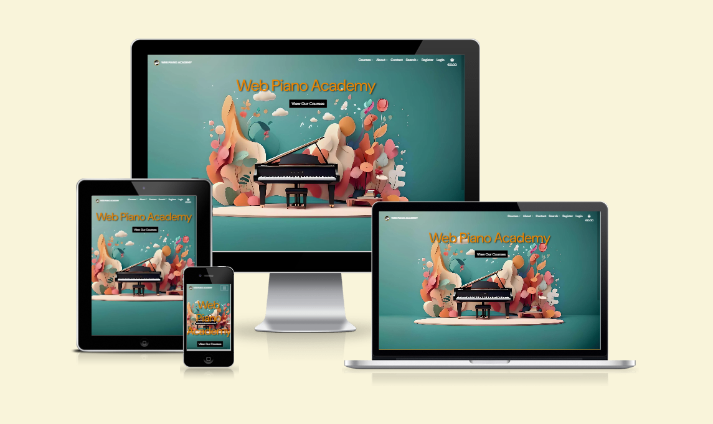

Web Piano Academy is a fully functioning e-commerce web application. The site allows users to view and purchase digital piano courses online. Users can easily create personal accounts and profiles and see information on the site, and the courses themselves. The site also enables administrators to add, edit and remove products, as well as view and rspond to contact enquiries.

## UX

The design philosophy was to create a fun, engaging look, while keeping relevant information presented in a salient and clean manner, allowing the user to easily and pleasingly navigate through the site.

### Colour Scheme

I used [coolors.co](https://coolors.co/2c6967-f8ddd0-e67e7c-ed8500-000000-ffffff) to generate my colour palette.

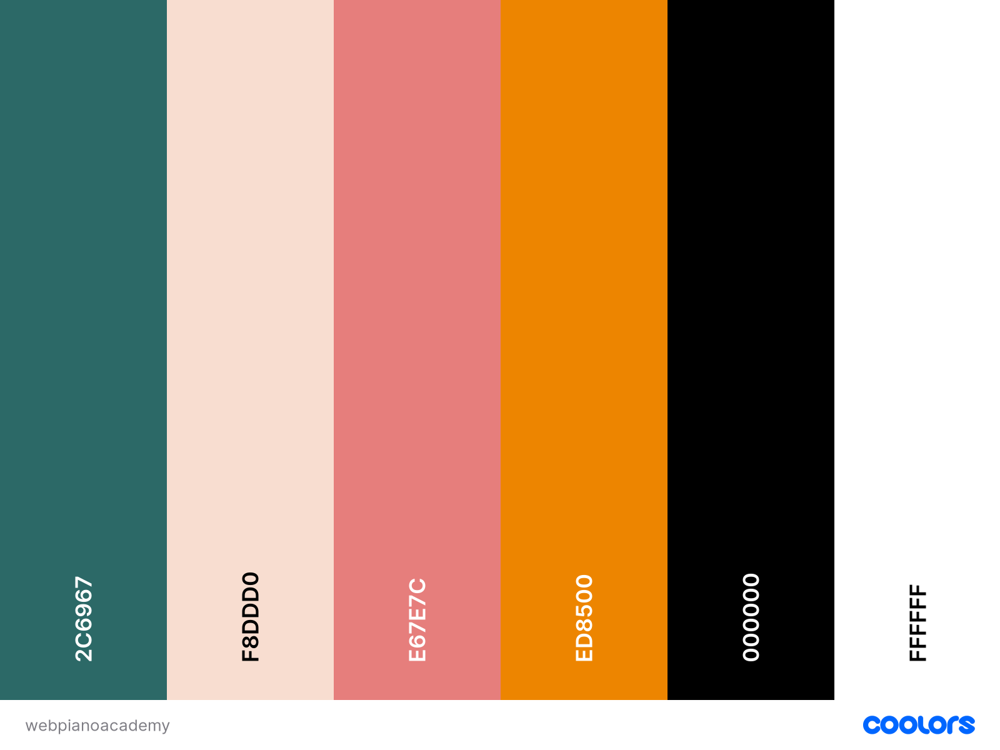

### Typography

- [DM Sans](https://fonts.google.com/specimen/DM+Sans) was used for the primary headers and titles and text.

- [Font Awesome](https://fontawesome.com) icons were used throughout the site.

## User Stories

All user stories can be found in a linked GitHub project [here](https://github.com/users/LewisMDillon/projects/5)

## Features

### Existing Features

### Site Pages

- **Homepage**

    - The main homepage for the site. Hero image is large and striking. Large heading tells users they are in the right place. Call to action button to invite users to enter and explore the site products.

- **Courses Page**

    - Courses page. Displays the site products availiable for the user to purchase. Displays images of products and their essential information including title, description, price, category & level. Courses are displayed in a pleasing responsive grid layout, making it easy for a user to browse the courses. Courses utilise a mouse-hover animation to add to the interactivity of the page. Courses can also be filtered and sorted by name, price and other criteria.
    Administrators viewing this page can see links under each course to edit or delete the course.

- **About Page**

    - About page. Gives users essential information about Web Piano Academy. Text content interspersed with pictures helps to break up the page and keep the user engaged with the presented information. 

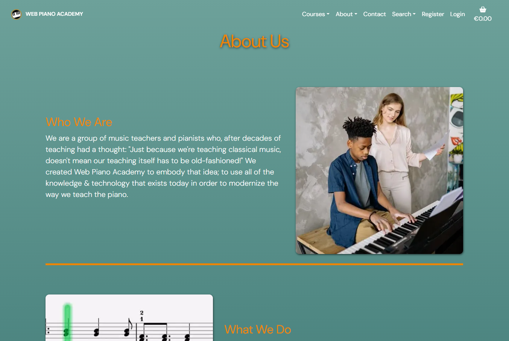

- **FAQ Page**

    - FAQ Page. Displays the most frequently asked questions about the site. Lets user's know essential information and quells worries that they may have about the site and its products. Animation and accordion serve to make the information engaging and clean.

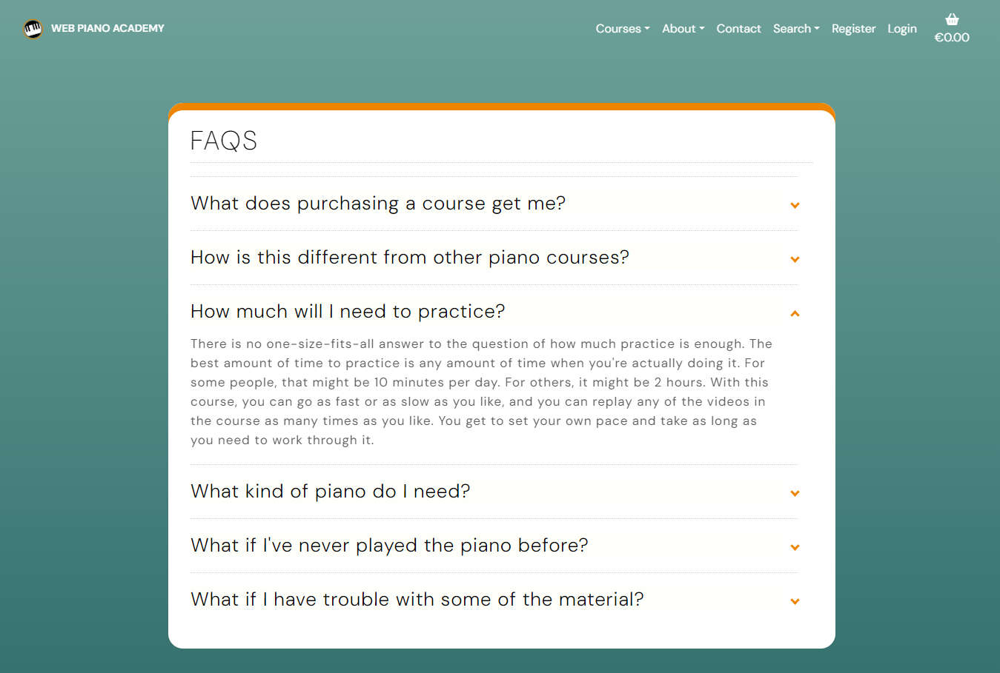

- **Contact Page**

    - Contact Page. Users can contact the site owner using the contact form. If the user is logged in, their email is pre-filled in the email input field. Users can choose from a selection of subjects and leave their message via the text box. 

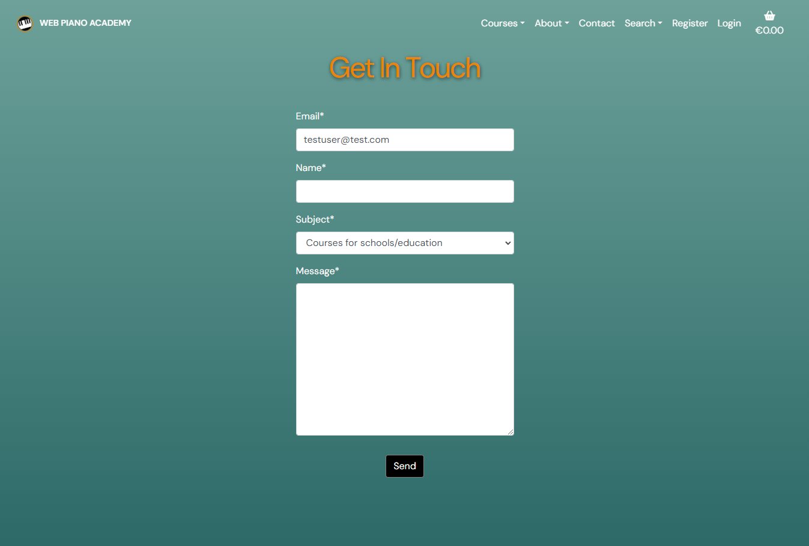

- **Contact Success Page**

    - Contact Success Page. Users see this page after sending a contact message via the contact page. This page serves to confirm to the user that their message has been sent successfully. A short message informs the user that their contact message has been received, an that one of the team will respond as soon as possible.

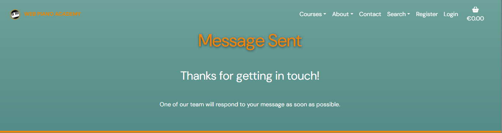

- **Contact Requests Page - Admin Only**

    - Contact Requests Page. Admins can see a list of all of the contact messages sent by users. Messages are displayed in an easy-to-read table, with all of the salient information presented. Messages are automatically sorted with those messages which have not been responded to at the top of the list, with the oldest (the message which has gone unanswered the longest) at the top. Admins can click on the view details links to see the full contact messages, as well as respond to the message.

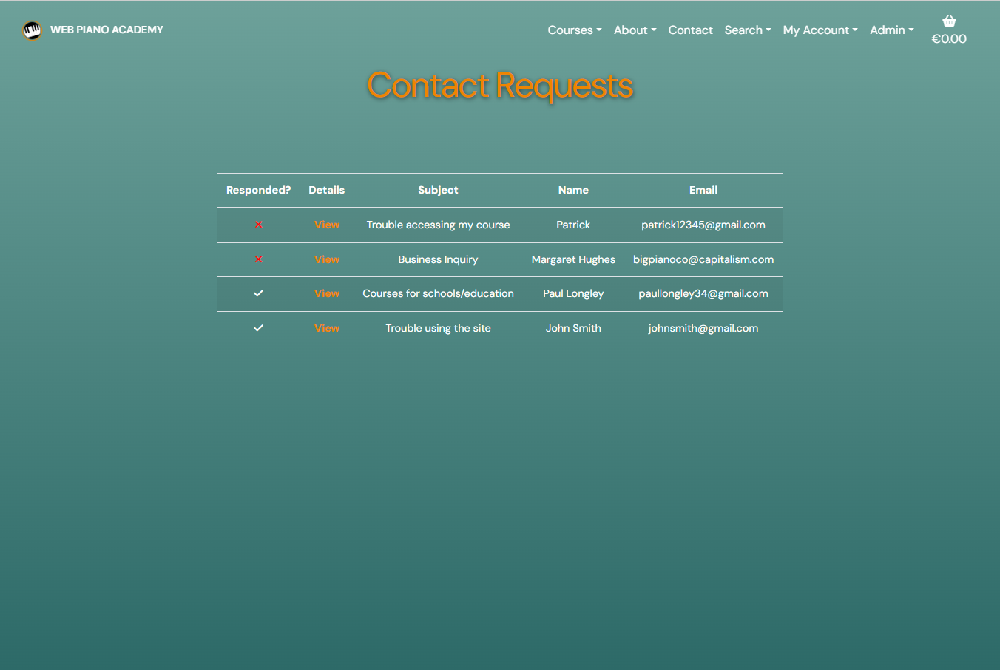

- **Contact Details Page - Admin Only**

    - Contact Details Page. Admins can see details of a contact message left by the user. All of the contact message's information can be seen, including email, name, subject, message, and whether this contact message has been respondd to. Contact messages can be responded to or deleted via the large buttons at the bottom of the page. A link navigates back to the contact requests page.

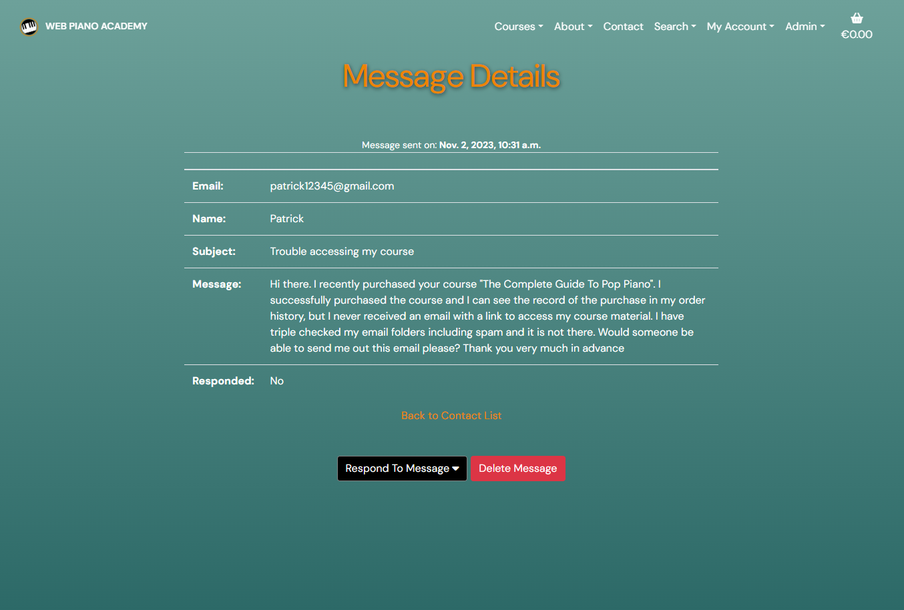

- **Contact Delete Page - Delete - Admin Only**

    - Contact Message Delete Page. An admin sees this page after clicking the delete message button on the Contact Details Page. This page double checks that deletion of the contact message is the intended course of action and allows an admin to either confirm the action or return to the contact message's detail page.

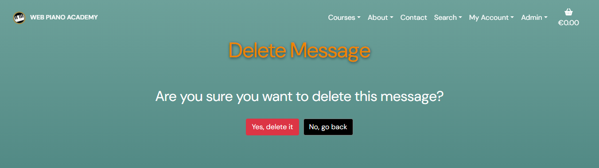

- **Signup Page**

    - Signup Page. Displays a signup form that new users can use to register an account on the site. Simple input fields for email, uername and password make it easy for users to sign up for an account, an confirmation inputs insure that users do not accidentally register with incorrect information. A sign in link at the top of the page lets users who already have an account easily find the login page.

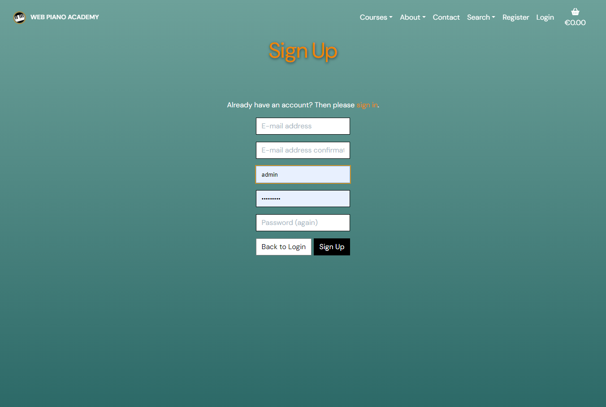

- **Login Page**

    - Login Page. Displays a login form that existing users can use to log in to the site. Two simple input fields for username and password make it easy for users to log in to their account. A 'remember me' checkbox allows users to chooe to have their login information stored for faster login in future. A Forgot Password link takes users to another page where they can recover their password. A sign up link at the top of the page lets users who do not yet have an account easily find the register page.

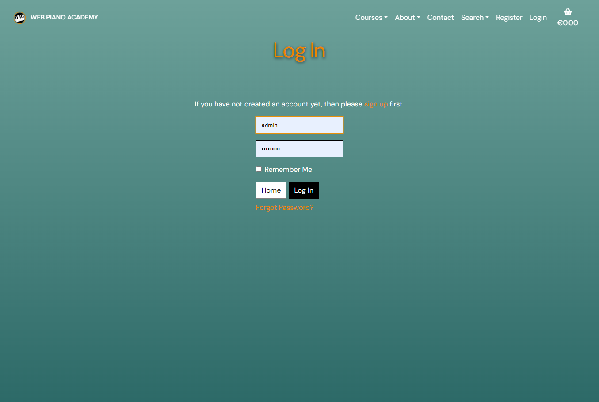

- **Logout Page**

    - Logout Page. Displays a logout confirmation message wih two buttons allowing th user to confirm the action and logout, or to return to the previous page and stay logged in.

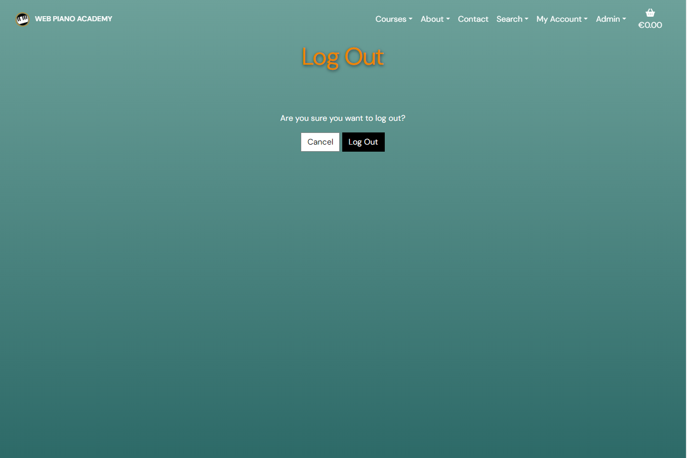

- **Profile Page**

    - Profile page. Displays a user's profile information. Lets a user see their relevant profile information in a clean and simple way, and contains an update form that users can use to update their profile information. Users can also see their order history, with full details of their order as well as links to see past order confirmations.

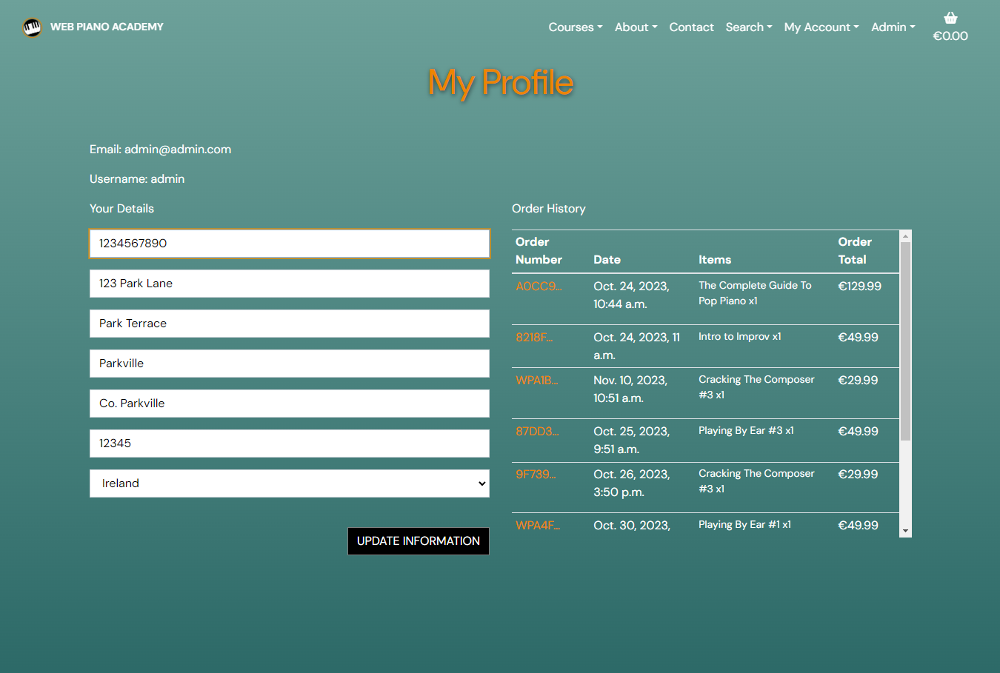

- **Shopping Basket Page**

    - Shopping Basket page. Displays all items currently in the user's shopping basket. Users get a message if their basket is empty, otherwise they will see a list of courses that they have selected with a button to navigate to the courses page, and another to navigate to the checkout page.

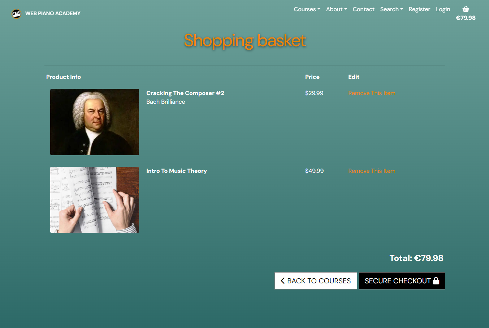

- **Checkout Page**

    - Checkout page. Displays an order summary of the items that are being prepared for purchase with accompanying item details. Displays a total cost of the order to the user. The user also sees a form to fill in their personal details. For logged in users, these details will be pre-filled if the user has provided that information in the past. A tooltip explains to users why their address details might be nedd despite ordring a digital product. A checkbox allows users to save entered information to their profile. A payment input form exists at the bottom of the page for a user to enter their payment card information. A message below this warns the user that advancing will complete the purchase and incur a charge to their card.

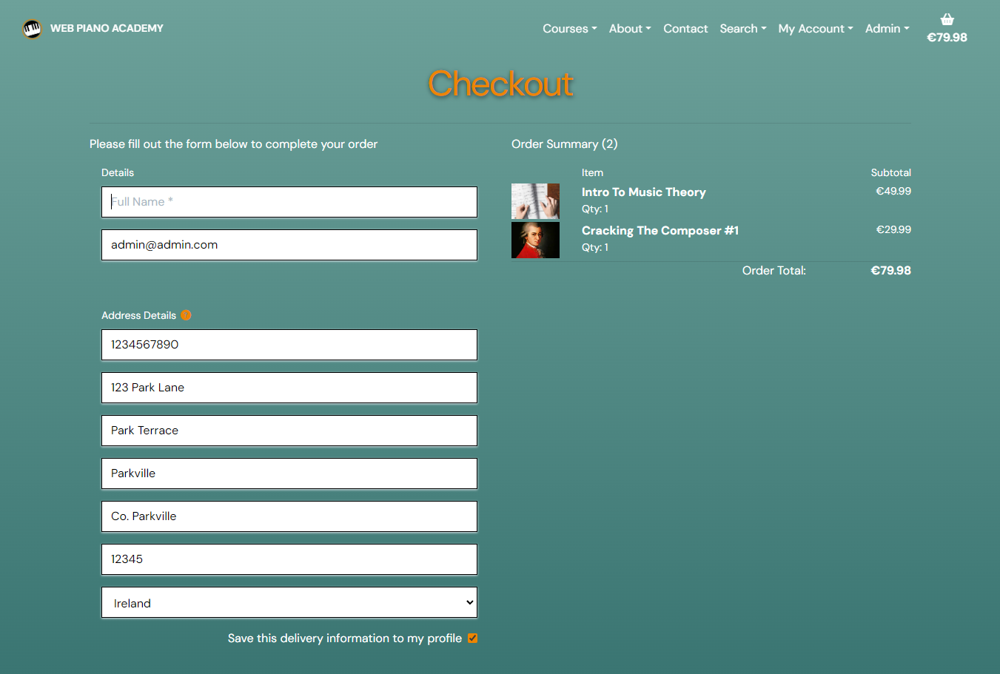
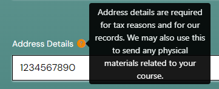
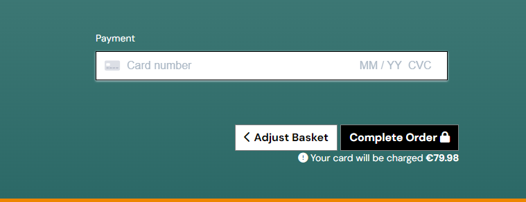

- **Checkout Success Page**

    - Checkout Success Page. Displays a thank you message to the user, as well as a message describing how to access their purchased course. Also displays an order summary with all the relevant information, including a unique order number beginning with WPA (for Web Piano Academy) followed by 10 random digits & letters generated by uuid.

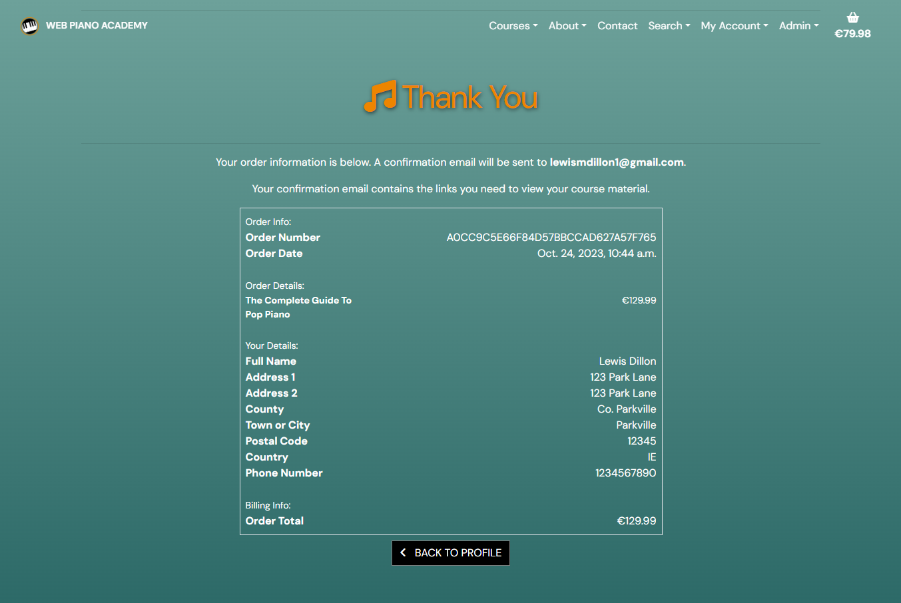

- **Add Product Page - Admin Only**

    - Add Product Page. Admins can use this form to add new products to the site. User-friendly form inputs allow product objects to be created simply and quickly.

- **Edit Product Page - Admin Only**

    - Edit Product Page. Admins can use this form to add edit products to the site. User-friendly form inputs allow product objects to be edited simply and quickly. A message at the top of the page informs the admin which product they are editing.

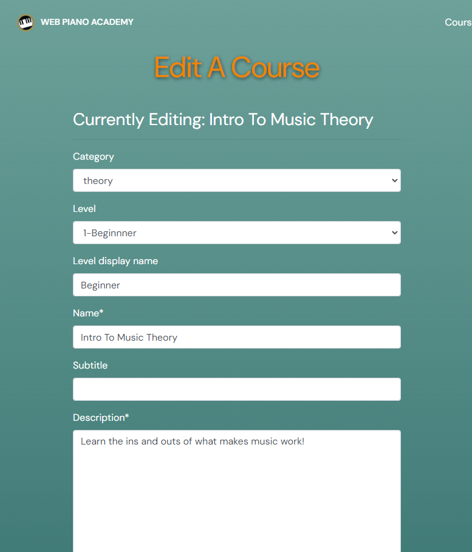

- **Custom Error Pages**

    - Custom error handler pages. These pages display when a user encounters one of the following common errors: 400, 403, 404, 500. These provide a more user-friendly error page than the user would see otherwise and includes an informative message and button to return home to the site. 

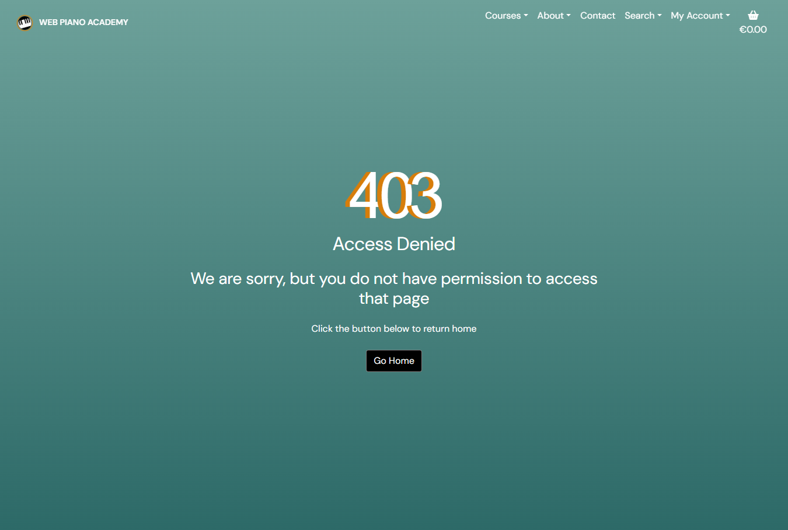
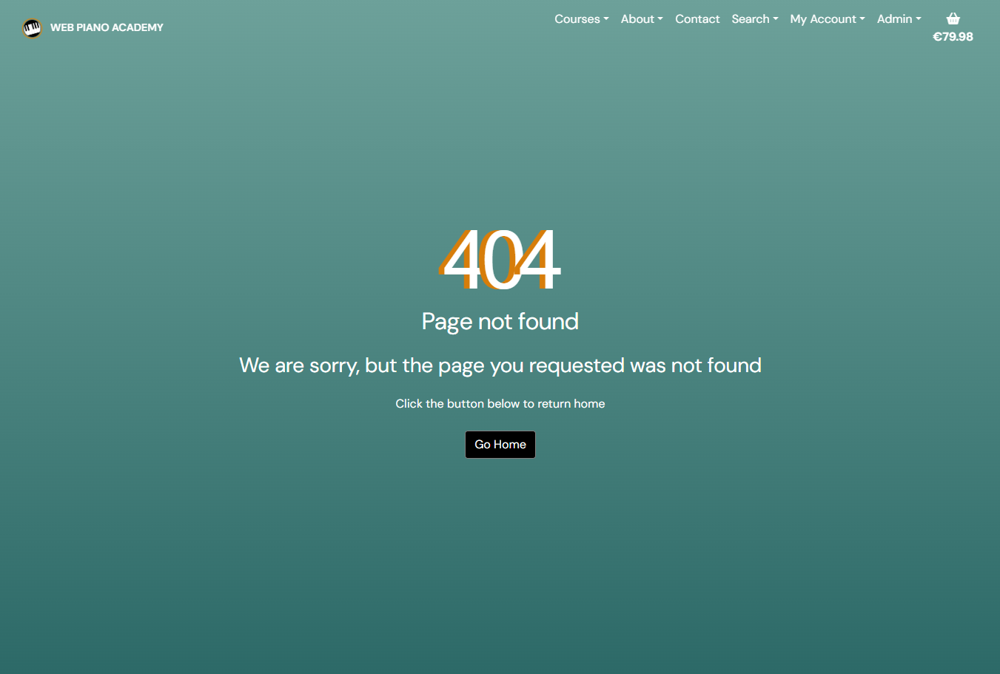
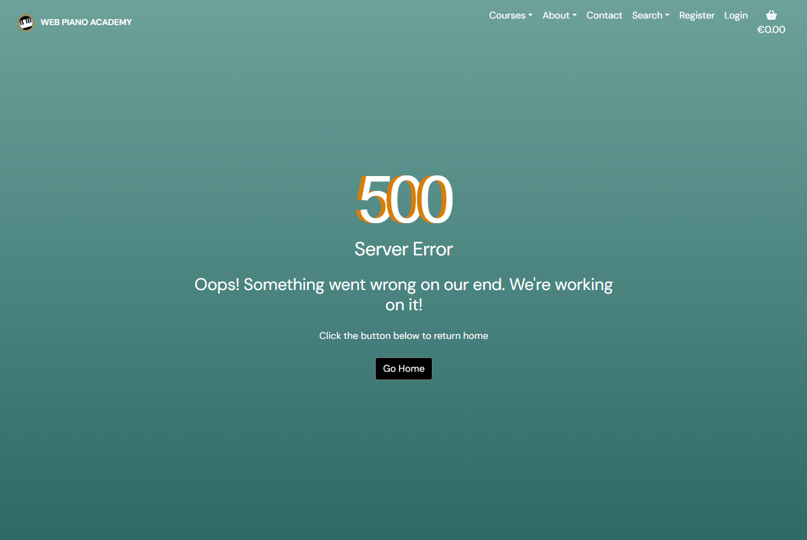

### User Features

- **User Registration**

    - Users can register for an account using a front-end form. This creates a user object in the database and automatically secures the user's sensitive information.

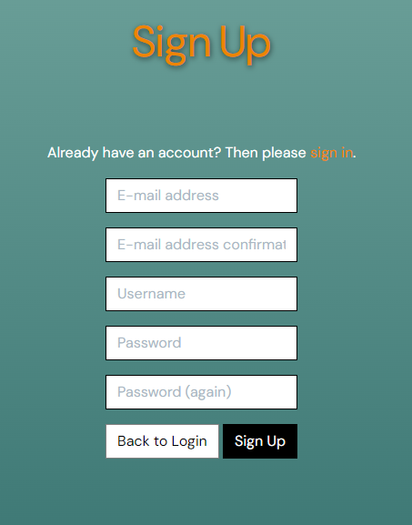

- **User Login**

    - Users who have made an account can quickly and easily log in to their account in order to access the login-required functionality of the site.

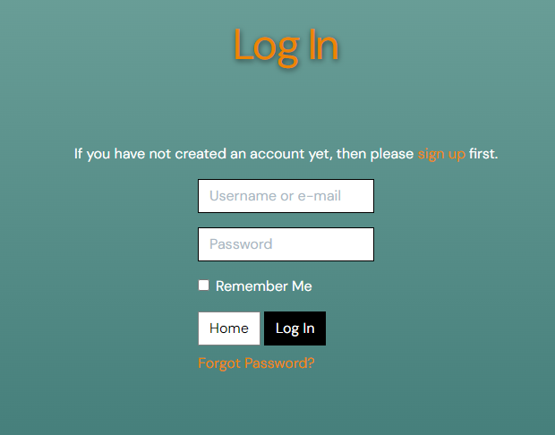

- **User Logout**

    - Users who are logged in can easily log out in order to stop access to their account-based information and functionality.

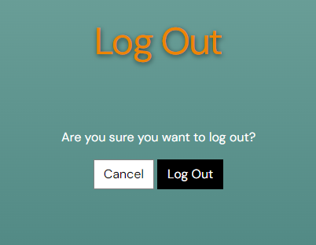

- **User Password Recovery**

    - Users who have forgotten their password can recover their password via the forgot password link on the login page. Users will enter their email and get a password reset link sent to their account email which they can use to set a new password.

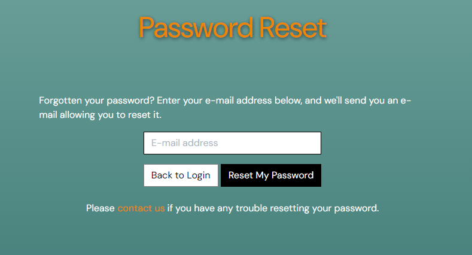

- **Toasts**

    - Users see helpful popup messages when performing actions on the site. These messages inform the user of the success or failure of their actions, as well as providing information about an action taken, or steps that the user mus take in order to correct an action.

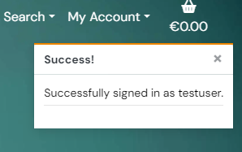
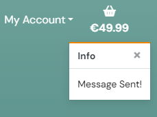
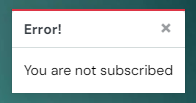

- **Basket Updates**

    - Via toasts, users can see a summary of their basket whenever an item is added, allowing the user to quickly see the new state of their basket, without having to navigate away from the page they are currently on.

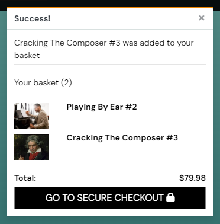

- **Login Dependant Navbar Links**

    - Users who are logged in see new links in the navbar. 'Register' and 'Login' links are replaced with 'My Account' links. This provides the user with visual feedback upon logging in, as well as removing links that they will not need.

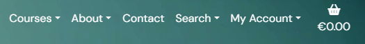

- **Login Redirect**

    - Users who are not logged in who attempt to access an area of the site which requires login are redirected to the login page. After logging in, they are sent to the page they first intended to visit.

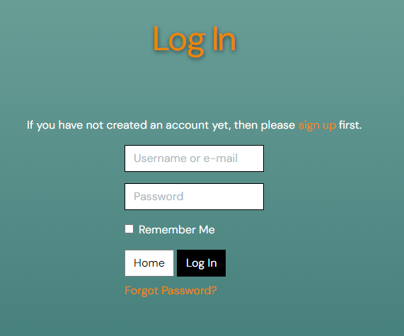

- **User Profile Creation**

    - User profiles are automatically created upon user registration. This assigns each user a profile which they can use to see/update their user information.

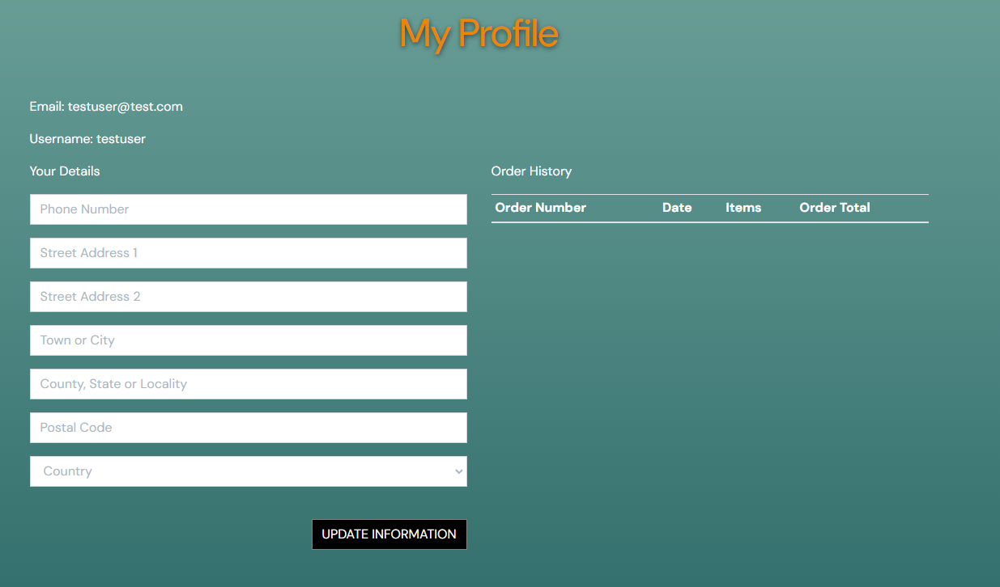

- **User Profile Update**

    - Users can update their profile information using a front-end form located on their user profile page. This allows users to update profile information or correct possible mistakes made at registration.

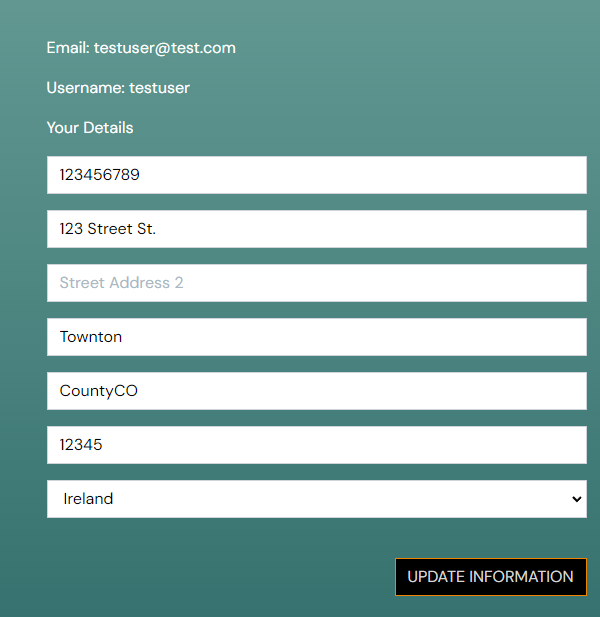

- **User Contact**

    - Users can use a front-end form to message the site owners. The form is easy to use and pre-fills the user's email address if they are logged in. Users get confirmation that their message was sent, and a message that someone from the site will be in touch as soon as possible

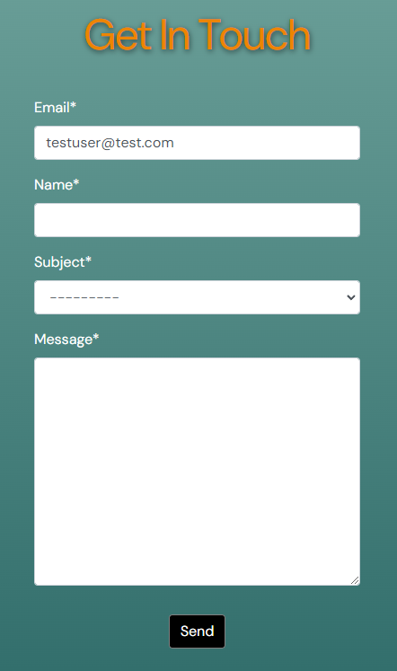

- **User Email Confirmations**

    - After making a purchase or subscribing to the newsletter, the site automatically sends the user a confirmation email which contains their purchase details, or in the case of newsletter subscription, a thank you message and a link to unsubscribe.

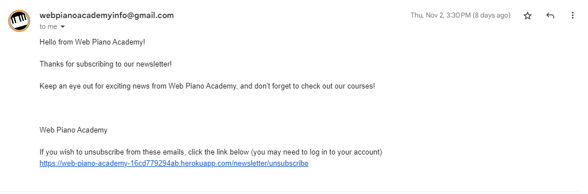

- **Course Sort**

    - Users can use a front-end dropdown box to sort the available courses by criteria such as price, name, category, and level. This allows the user to get to the relevant content more quickly, without having to manually sort through the entire product list.

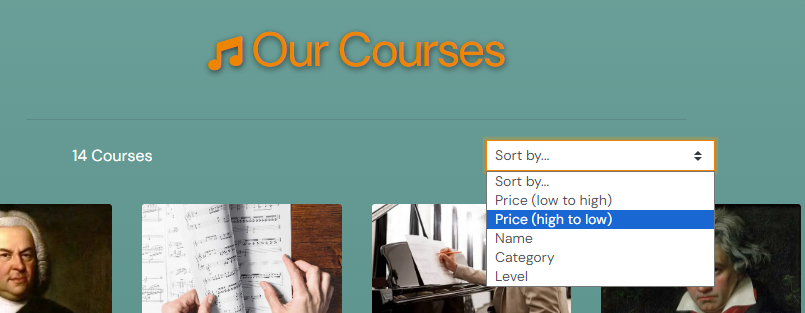

- **Course Search**

    - Users can use a front-end dropdown to enter search criteria for the purposes of searching for courses to purchase. This allows users to instantly find courses related to their search keywords, allowing them to navigate straight to the relevant products.

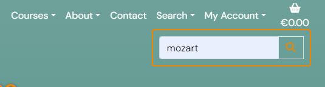

- **Newsletter Subscribe**

    - Users can use a button in the footer of all site pages to subscribe to the site newsletter. If the user is logged in, the email input field will pre-fill with the user's email. Users see a confirmation screen after subscribing, and receive a confirmation email to the address they provided.

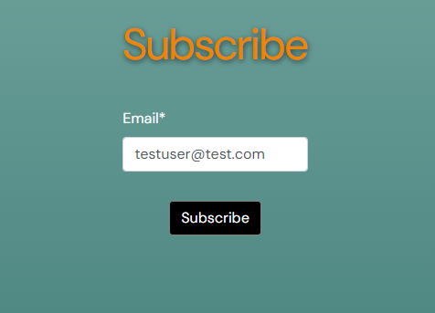
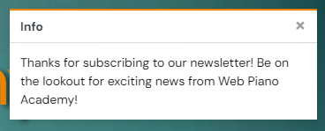

- **Newsletter Unsubscribe**

    - Users can click the link in their newsletter email to unsubscribe from the site newsletter. Once the user is logged in, the email input field will pre-fill with the user's email. Users see a confirmation screen after unsubscribing.

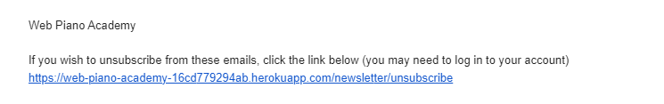
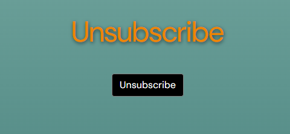
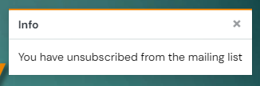

### Admin Features

- **Create Products**

    - Administrators can use a front-end form to create new site products. The form is simple and clean and automatically formats and displays the created product in the same manner as existing products.

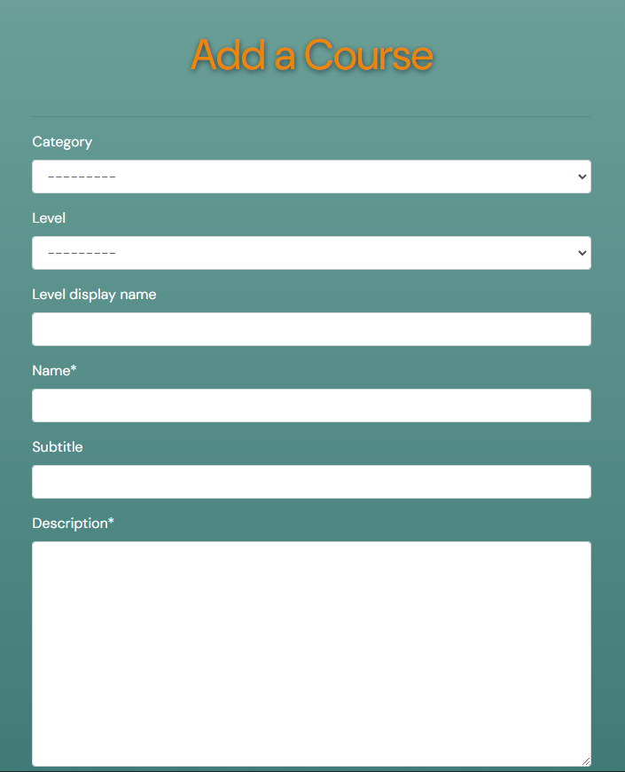

- **Edit Products**

    - Administrators can use a front-end form to update existing products. If the current logged-in user has superuser privileges, an edit button will appear under products which allows that user to edit the product's details.

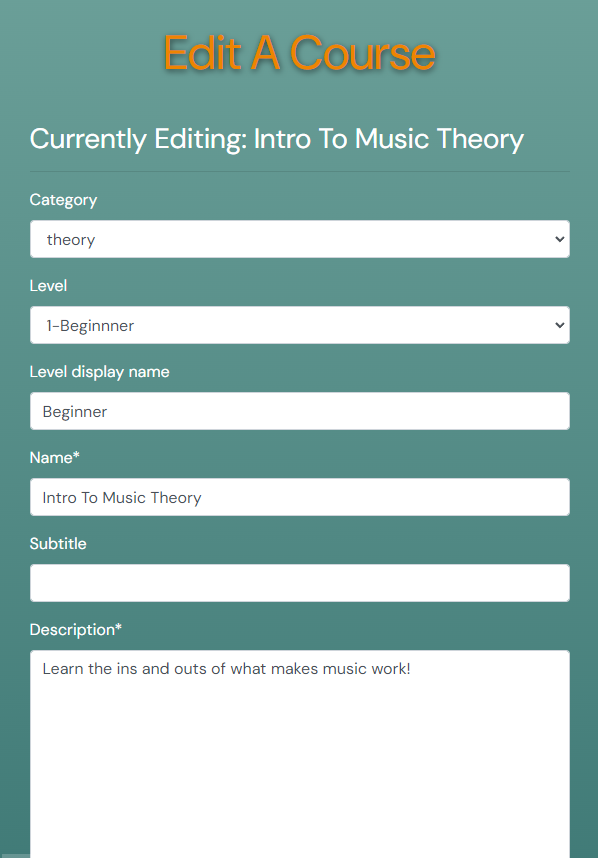

- **Delete Products**

    - Administrators can use a front-end form to delete existing products. If the current logged-in user has superuser privileges, a delete button will appear under posts which allows that user to delete that product.

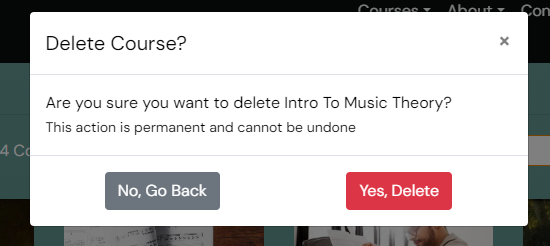

- **Contact Requests**

    - Admins can see a list of all of the contact messages sent by users. Messages are displayed in an easy-to-read table, with all of the salient information presented. Messages are automatically sorted with those messages which have not been responded to at the top of the list, with the oldest (the message which has gone unanswered the longest) at the top. Admins can click on the view details links to see the full contact messages, as well as respond to the message.

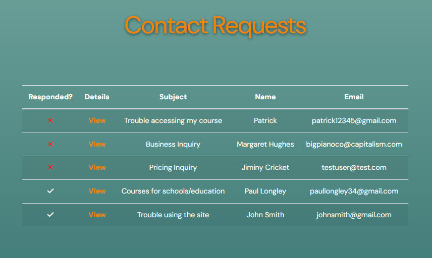

- **Contact Details**

    - Admins can see details of a contact message left by the user. All of the contact message's information can be seen, including email, name, subject, message, and whether this contact message has been respondd to. Contact messages can be responded to or deleted via the large buttons at the bottom of the page. A link navigates back to the contact requests page.

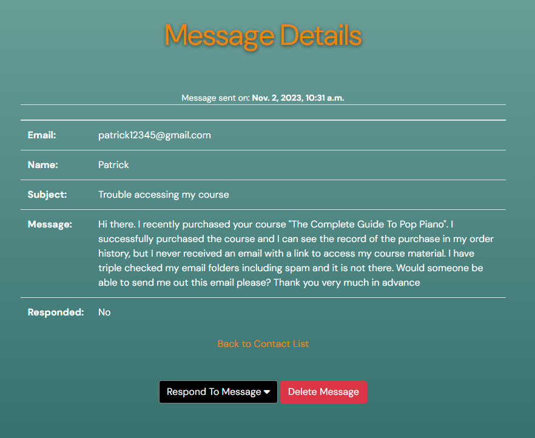

- **Contact Message Delete**

    - Admins can delete contact messages from the database using a front end delete function insice the contact message details page.

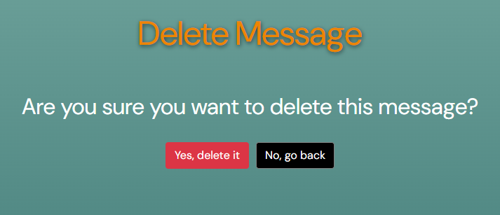

- **Contact Respond**

    - Admins can respond to user contact messages using an email form which appears upon clicking the 'respond to message' button on the contact details page. A text area appears with the user's name and the default email signoff link pre-populated for efficiency in the typing of the response. The 'Send Email' button sends an email response to the user's given email address with the content of the text box as the body of the email.

    The contact message is then automatically marked as 'Responded' and the 'respond to message' button no longer appears on that message's details page.

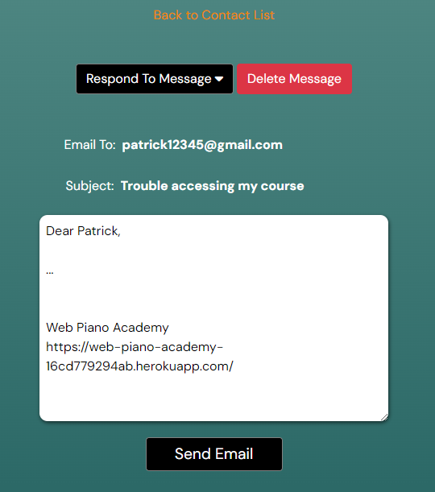
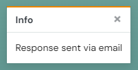
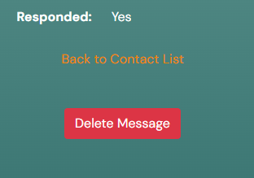

- **Newsletter Confirmation Emails**

    - Emails are automatically sent out to all new subscribers of the site newsletter. The email contains a 'thank you' message, as well as a link to allow users to unsubscribe from the mailing list.

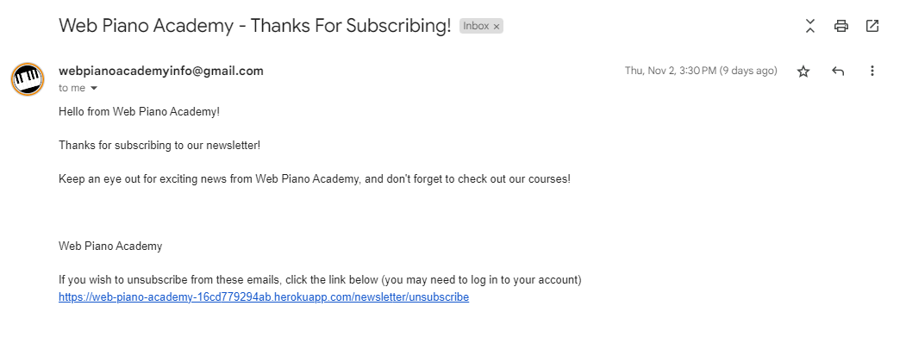

### Future Features

- Subscription Payments
    - Possible subscription payment model which would include access to all courses for a recurring fee. Could implement this via django groups with subscriber accounts given priveleges to view subscriber-only areas of the site. Would also need to implement this in the stripe backend and update webhooks.
- Newsletter Template and Front-End Customisation
    - A system in which an admin could easily customise and send out a newsletter to all subscribers. Would need a front-end form which could take text & images, and would need to add the functionality into the newsletter views.
- Digital Music Sheet Sales
    - Sale of digital music sheets to accompany the course material. Could sell the music sheets in PDF format or as interactive sheets as part of another interactive music learning app. This would not be difficult to implement, but would need some revision of the user shopping experience as shopping for courses and for digital sheets is quite different. Things like item quantity would need to be revised.

## Tools & Technologies Used

- [HTML](https://en.wikipedia.org/wiki/HTML) used for the main site content.
- [CSS](https://en.wikipedia.org/wiki/CSS) used for the main site design and layout.
- [CSS Flexbox](https://www.w3schools.com/css/css3_flexbox.asp) used for an enhanced responsive layout.
- [CSS Grid](https://www.w3schools.com/css/css_grid.asp) used for an enhanced responsive layout.
- [JavaScript](https://www.javascript.com) used for user interaction on the site.
- [Python](https://www.python.org) used as the back-end programming language.
- [Git](https://git-scm.com) used for version control. (`git add`, `git commit`, `git push`)
- [GitHub](https://github.com) used for secure online code storage.
- [GitHub Pages](https://pages.github.com) used for hosting the deployed front-end site.
- [Gitpod](https://gitpod.io) used as a cloud-based IDE for development.
- [Bootstrap](https://getbootstrap.com) used as the front-end CSS framework for modern responsiveness and pre-built components.
- [Django](https://www.djangoproject.com) used as the Python framework for the site.
- [PostgreSQL](https://www.postgresql.org) used as the relational database management.
- [ElephantSQL](https://www.elephantsql.com) used as the Postgres database.
- [Psycopg2](https://pypi.org/project/psycopg2/) used as a PostgreSQL database adapter
- [Heroku](https://www.heroku.com) used for hosting the deployed back-end site.
- [Stripe](https://stripe.com) used for online secure payments of ecommerce products/services.
- [AWS S3](https://aws.amazon.com/s3) used for online static file storage.
- [Allauth](https://docs.allauth.org/en/latest/) used as the user authentication system
- [Pillow](https://pypi.org/project/Pillow/) used as the Python framework for the site.
- [Gunicorn](https://docs.gunicorn.org/en/stable/index.html) used for WSGI server
- [Crispy Forms](https://django-crispy-forms.readthedocs.io/en/latest/) used for auto-formatting of front-end forms

## Database Design

While planning this project, I drew up an Entity Relationship Diagram to help me to visualise the database models and their relationships.

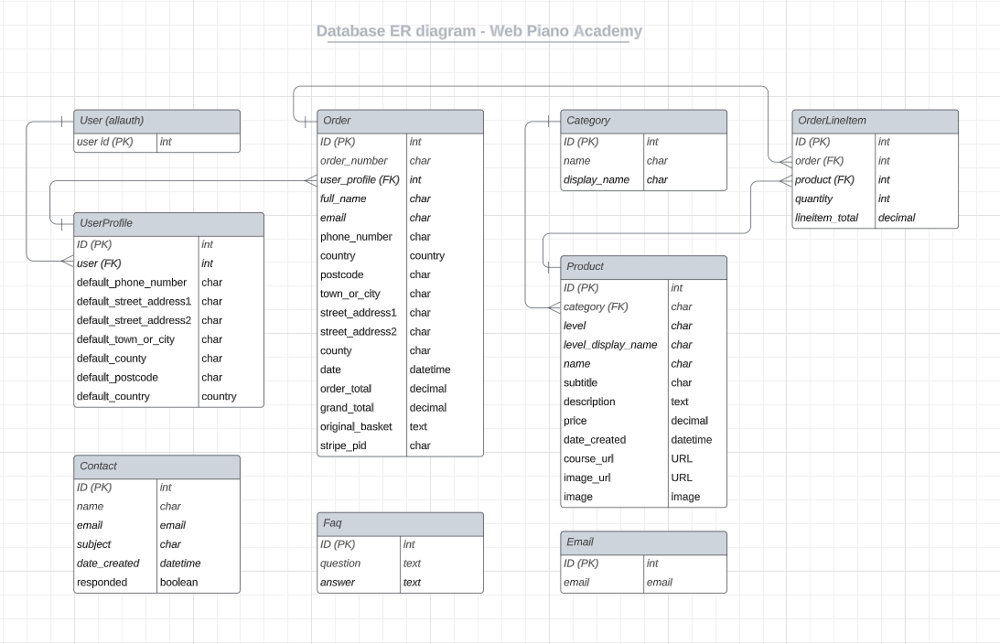

## Agile Development Process

### GitHub Projects

[GitHub Projects](https://github.com/LewisMDillon/web-piano-academy/projects) served as an Agile tool for this project.
It isn't a specialized tool, but with the right tags and project creation/issue assignments, it can be made to work.

Through it, user stories, issues, and milestone tasks were planned, then tracked on a weekly basis using the basic Kanban board.

The MoSCoW method was used with accompanying custom Github project labels to help me to prioritise the important tasks in the time I had available.

Epics were decomposed into smaller User Stories, which were themselves further broken down into Tasks. The Github issue linking system was utilised to ensure that user stories which were children of an epic were kept organised and easily accessible through these links

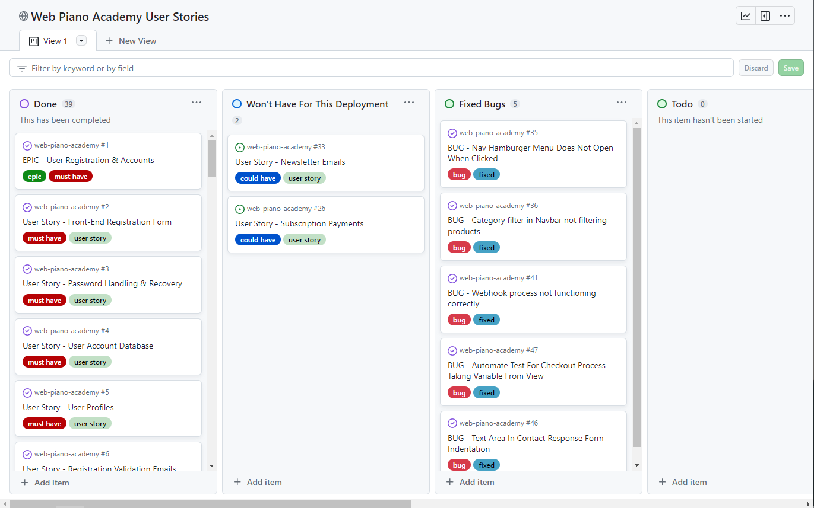
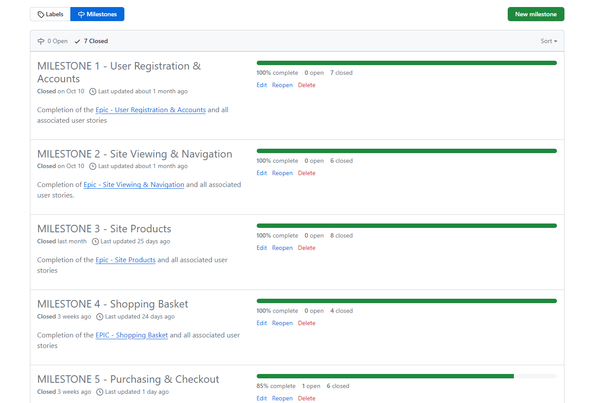
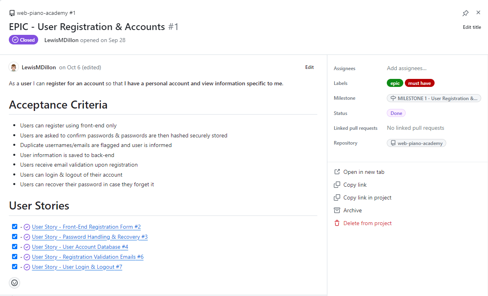
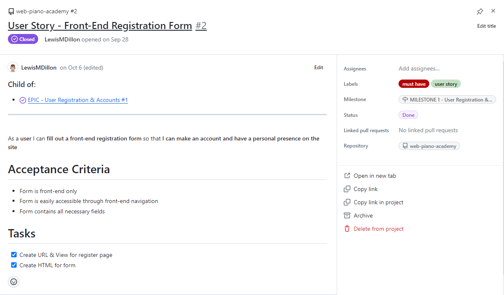

### GitHub Issues

[GitHub Issues](https://github.com/LewisMDillon/web-piano-academy/issues) served as an another Agile tool.
There, I used my own **User Story Template** and **Epic Template** to manage user stories.

It also helped with milestone iterations on a weekly basis.

- [Open Issues](https://github.com/LewisMDillon/web-piano-academy/issues)

    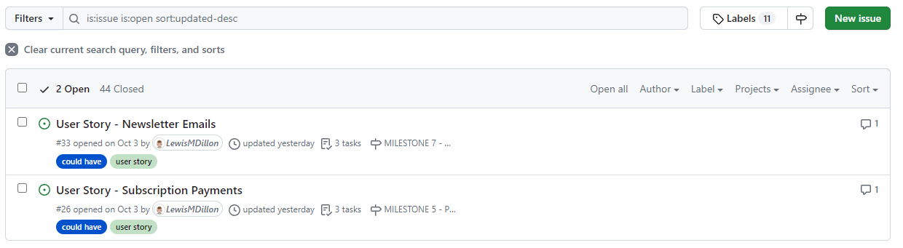

- [Closed Issues](https://github.com/LewisMDillon/web-piano-academy/issues?q=is%3Aissue+is%3Aclosed)

    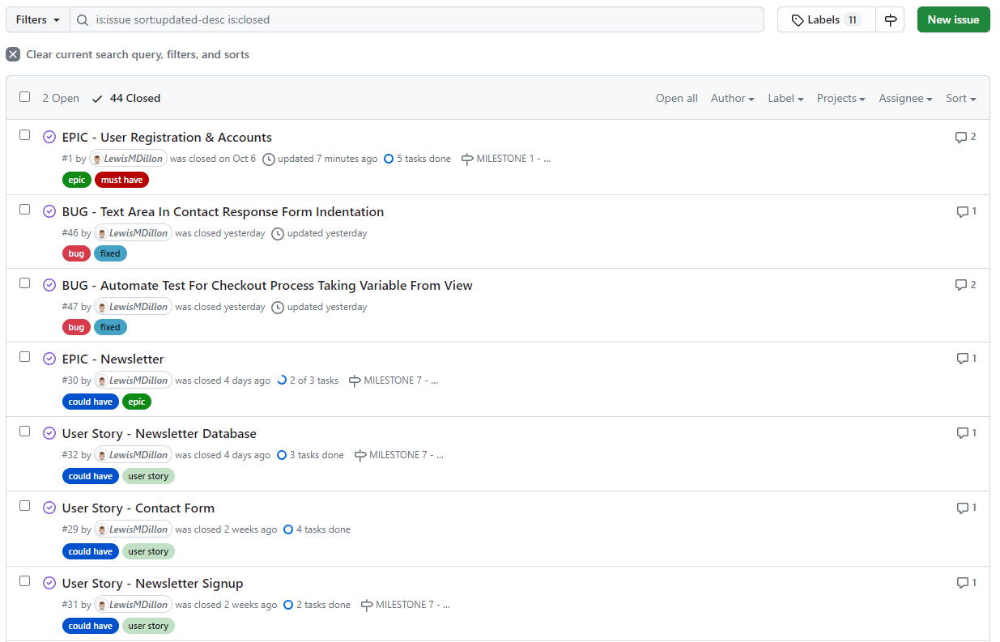

### MoSCoW Prioritization

I've decomposed my Epics into stories prior to prioritizing and implementing them.
Using this approach, I was able to apply the MoSCow prioritization and labels to my user stories within the Issues tab.

-   : guaranteed to be delivered (*max 60% of stories*) 
- 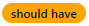  : adds significant value, but not vital (*the rest ~20% of stories*) 
- 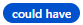  : has small impact if left out (*20% of stories*) 
- 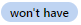  : not a priority for this iteration 

