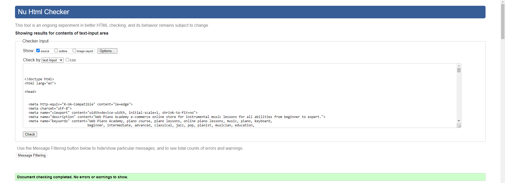

# Testing

Return back to the [README.md](README.md) file.

## Code Validation

### HTML

I have used the recommended [HTML W3C Validator](https://validator.w3.org) to validate all of my HTML files.

| Page | W3C URL | Screenshot | Notes |
| --- | --- | --- | --- |
| 400 | [W3C - Validated By Input](https://validator.w3.org/#validate_by_input) |  | Pass: No Errors |
| 403 | [W3C - Validated By Input](https://validator.w3.org/#validate_by_input) |  | Pass: No Errors |
| 404 | [W3C - Validated By Input](https://validator.w3.org/#validate_by_input) |  | Pass: No Errors |
| 500 | [W3C - Validated By Input](https://validator.w3.org/#validate_by_input) |  | Pass: No Errors |
| about | [W3C](https://validator.w3.org/nu/?doc=https%3A%2F%2Fweb-piano-academy-16cd779294ab.herokuapp.com%2Fabout%2F) |  | Pass: No Errors |
| add-product | [W3C - Validated By Input](https://validator.w3.org/#validate_by_input) |  | Pass: No Errors |
| basket | [W3C](https://validator.w3.org/nu/?doc=https%3A%2F%2Fweb-piano-academy-16cd779294ab.herokuapp.com%2Fbasket%2F) |  | Pass: No Errors |
| checkout | [W3C](https://validator.w3.org/nu/?doc=https%3A%2F%2Fweb-piano-academy-16cd779294ab.herokuapp.com%2Fcheckout%2F) |  | Pass: No Errors |
| checkout-success | [W3C - Validated By Input](https://validator.w3.org/#validate_by_input) |  | Pass: No Errors |
| contact | [W3C](https://validator.w3.org/nu/?doc=https%3A%2F%2Fweb-piano-academy-16cd779294ab.herokuapp.com%2Fcontact%2F) |  | Pass: No Errors |
| contact-confirm-delete | [W3C - Validated By Input](https://validator.w3.org/#validate_by_input) |  | Pass: No Errors |
| contact-list | [W3C - Validated By Input](https://validator.w3.org/#validate_by_input) |  | Pass: No Errors |
| contact-success | [W3C](https://validator.w3.org/nu/?doc=https%3A%2F%2Fweb-piano-academy-16cd779294ab.herokuapp.com%2Fcontact%2Fsuccess%2F) |  | Pass: No Errors |
| contact-update-form | [W3C - Validated By Input](https://validator.w3.org/#validate_by_input) |  | Pass: No Errors |
| courses | [W3C](https://validator.w3.org/nu/?doc=https%3A%2F%2Fweb-piano-academy-16cd779294ab.herokuapp.com%2Fproducts%2Fcourses%2F) |  | Pass: No Errors |
| edit-product | [W3C - Validated By Input](https://validator.w3.org/#validate_by_input) |  | Pass: No Errors |
| email-form | [W3C](https://validator.w3.org/nu/?doc=https%3A%2F%2Fweb-piano-academy-16cd779294ab.herokuapp.com%2Fnewsletter%2F) |  | Pass: No Errors |
| faq | [W3C](https://validator.w3.org/nu/?doc=https%3A%2F%2Fweb-piano-academy-16cd779294ab.herokuapp.com%2Ffaq%2F) |  | Pass: No Errors |
| home | [W3C](https://validator.w3.org/nu/?doc=https%3A%2F%2Fweb-piano-academy-16cd779294ab.herokuapp.com%2F) |  | Pass: No Errors |
| login | [W3C](https://validator.w3.org/nu/?doc=https%3A%2F%2Fweb-piano-academy-16cd779294ab.herokuapp.com%2Faccounts%2Flogin%2F) |  | Pass: No Errors |
| product-detail | [W3C](https://validator.w3.org/nu/?doc=https%3A%2F%2Fweb-piano-academy-16cd779294ab.herokuapp.com%2Fproducts%2Fcourses%2F12%2F) |  | Pass: No Errors |
| profile | [W3C - Validated By Input](https://validator.w3.org/#validate_by_input) |  | Pass: No Errors |
| register | [W3C](https://validator.w3.org/nu/?doc=https%3A%2F%2Fweb-piano-academy-16cd779294ab.herokuapp.com%2Faccounts%2Fsignup%2F) |  | Pass: No Errors |
| unsubscribe | [W3C - Validated By Input](https://validator.w3.org/#validate_by_input) |  | Pass: No Errors |

### CSS

I have used the recommended [CSS Jigsaw Validator](https://jigsaw.w3.org/css-validator) to validate all of my CSS files.

| File | Jigsaw URL | Screenshot | Notes |
| --- | --- | --- | --- |
| style.css | [Jigsaw](https://jigsaw.w3.org/css-validator/validator?uri=https%3A%2F%2Fweb-piano-academy-16cd779294ab.herokuapp.com%2F&profile=css3svg&usermedium=all&warning=1&vextwarning=&lang=en) |  | Pass: No Errors |
| checkout.css | n/a |  | Pass: No Errors |
| profile.css | n/a |  | Pass: No Errors |

### JavaScript

I have used the recommended [JShint Validator](https://jshint.com) to validate all of my JS files.

| File | Screenshot | Notes |
| --- | --- | --- |
| stripe_elements.js |  | Undefined Stripe variable |
| tooltips.js |  | Pass: No Errors |
| navbar.js |  | Pass: No Errors |
| countryfield.js |  | Pass: No Errors |

