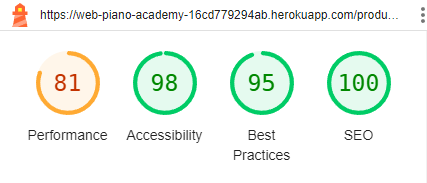
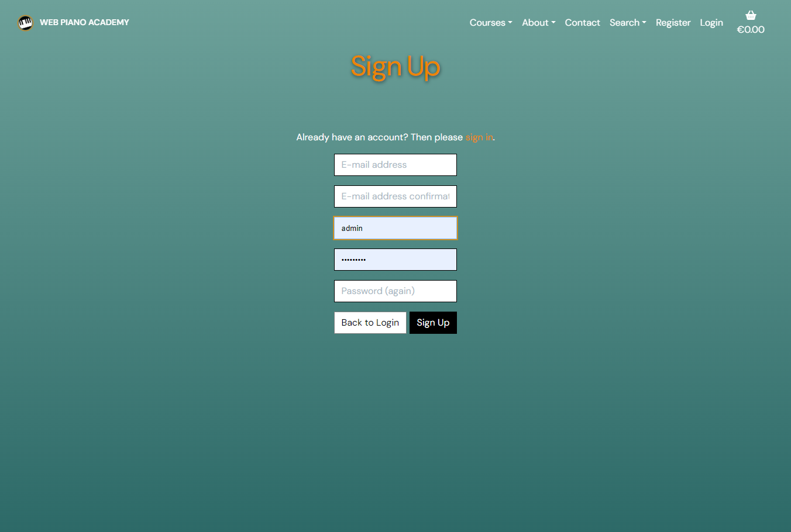
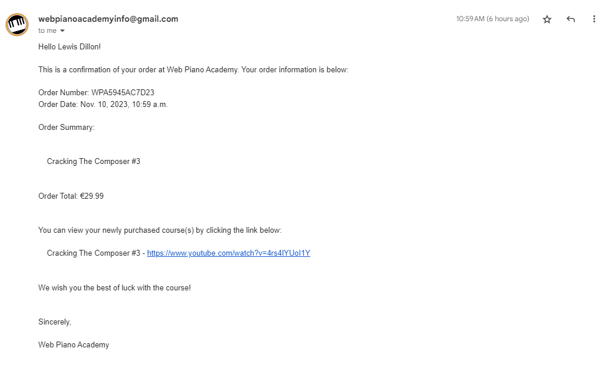
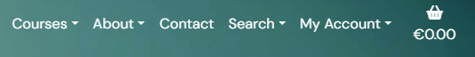
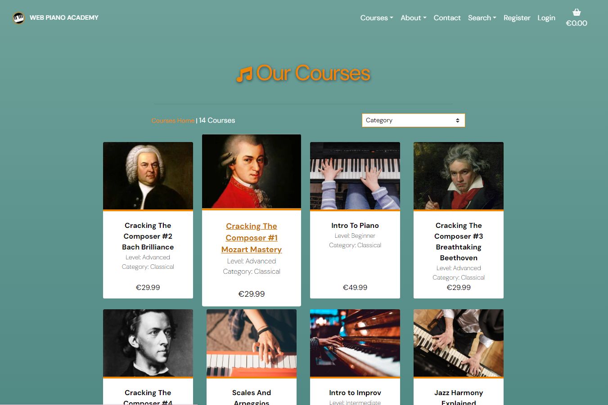
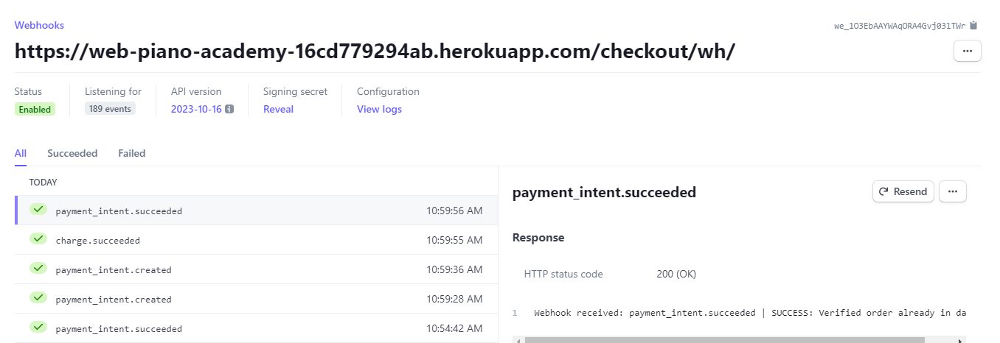
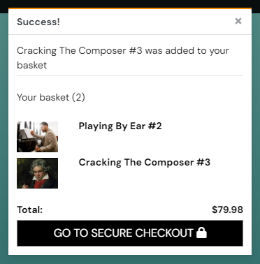
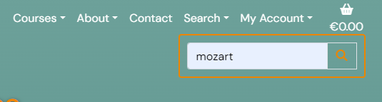

# Testing

Return back to the [README.md](README.md) file.

## Code Validation

### HTML

I have used the recommended [HTML W3C Validator](https://validator.w3.org) to validate all of my HTML files.

| Page | W3C URL | Screenshot | Notes |
| --- | --- | --- | --- |
| 400 | [W3C - Validated By Input](https://validator.w3.org/#validate_by_input) |  | Pass: No Errors |
| 403 | [W3C - Validated By Input](https://validator.w3.org/#validate_by_input) |  | Pass: No Errors |
| 404 | [W3C - Validated By Input](https://validator.w3.org/#validate_by_input) |  | Pass: No Errors |
| 500 | [W3C - Validated By Input](https://validator.w3.org/#validate_by_input) |  | Pass: No Errors |
| about | [W3C](https://validator.w3.org/nu/?doc=https%3A%2F%2Fweb-piano-academy-16cd779294ab.herokuapp.com%2Fabout%2F) |  | Pass: No Errors |
| add-product | [W3C - Validated By Input](https://validator.w3.org/#validate_by_input) |  | Pass: No Errors |
| basket | [W3C](https://validator.w3.org/nu/?doc=https%3A%2F%2Fweb-piano-academy-16cd779294ab.herokuapp.com%2Fbasket%2F) |  | Pass: No Errors |
| checkout | [W3C](https://validator.w3.org/nu/?doc=https%3A%2F%2Fweb-piano-academy-16cd779294ab.herokuapp.com%2Fcheckout%2F) |  | Pass: No Errors |
| checkout-success | [W3C - Validated By Input](https://validator.w3.org/#validate_by_input) |  | Pass: No Errors |
| contact | [W3C](https://validator.w3.org/nu/?doc=https%3A%2F%2Fweb-piano-academy-16cd779294ab.herokuapp.com%2Fcontact%2F) |  | Pass: No Errors |
| contact-confirm-delete | [W3C - Validated By Input](https://validator.w3.org/#validate_by_input) |  | Pass: No Errors |
| contact-list | [W3C - Validated By Input](https://validator.w3.org/#validate_by_input) |  | Pass: No Errors |
| contact-success | [W3C](https://validator.w3.org/nu/?doc=https%3A%2F%2Fweb-piano-academy-16cd779294ab.herokuapp.com%2Fcontact%2Fsuccess%2F) |  | Pass: No Errors |
| contact-update-form | [W3C - Validated By Input](https://validator.w3.org/#validate_by_input) |  | Pass: No Errors |
| courses | [W3C](https://validator.w3.org/nu/?doc=https%3A%2F%2Fweb-piano-academy-16cd779294ab.herokuapp.com%2Fproducts%2Fcourses%2F) |  | Pass: No Errors |
| edit-product | [W3C - Validated By Input](https://validator.w3.org/#validate_by_input) |  | Pass: No Errors |
| email-form | [W3C](https://validator.w3.org/nu/?doc=https%3A%2F%2Fweb-piano-academy-16cd779294ab.herokuapp.com%2Fnewsletter%2F) |  | Pass: No Errors |
| faq | [W3C](https://validator.w3.org/nu/?doc=https%3A%2F%2Fweb-piano-academy-16cd779294ab.herokuapp.com%2Ffaq%2F) |  | Pass: No Errors |
| home | [W3C](https://validator.w3.org/nu/?doc=https%3A%2F%2Fweb-piano-academy-16cd779294ab.herokuapp.com%2F) |  | Pass: No Errors |
| login | [W3C](https://validator.w3.org/nu/?doc=https%3A%2F%2Fweb-piano-academy-16cd779294ab.herokuapp.com%2Faccounts%2Flogin%2F) |  | Pass: No Errors |
| product-detail | [W3C](https://validator.w3.org/nu/?doc=https%3A%2F%2Fweb-piano-academy-16cd779294ab.herokuapp.com%2Fproducts%2Fcourses%2F12%2F) |  | Pass: No Errors |
| profile | [W3C - Validated By Input](https://validator.w3.org/#validate_by_input) |  | Pass: No Errors |
| register | [W3C](https://validator.w3.org/nu/?doc=https%3A%2F%2Fweb-piano-academy-16cd779294ab.herokuapp.com%2Faccounts%2Fsignup%2F) |  | Pass: No Errors |
| unsubscribe | [W3C - Validated By Input](https://validator.w3.org/#validate_by_input) |  | Pass: No Errors |

### CSS

I have used the recommended [CSS Jigsaw Validator](https://jigsaw.w3.org/css-validator) to validate all of my CSS files.

| File | Jigsaw URL | Screenshot | Notes |
| --- | --- | --- | --- |
| style.css | [Jigsaw](https://jigsaw.w3.org/css-validator/validator?uri=https%3A%2F%2Fweb-piano-academy-16cd779294ab.herokuapp.com%2F&profile=css3svg&usermedium=all&warning=1&vextwarning=&lang=en) |  | Pass: No Errors |
| checkout.css | n/a |  | Pass: No Errors |
| profile.css | n/a |  | Pass: No Errors |

### JavaScript

I have used the recommended [JShint Validator](https://jshint.com) to validate all of my JS files.

| File | Screenshot | Notes |
| --- | --- | --- |
| stripe_elements.js |  | Undefined Stripe variable |
| tooltips.js |  | Pass: No Errors |
| navbar.js |  | Pass: No Errors |
| countryfield.js |  | Pass: No Errors |

### Python

I have used the recommended [PEP8 CI Python Linter](https://pep8ci.herokuapp.com) to validate all of my Python files.

### Basket App
| File | CI URL | Screenshot | Notes |
| --- | --- | --- | --- |
| apps.py | [PEP8 CI](https://pep8ci.herokuapp.com/https://raw.githubusercontent.com/LewisMDillon/web-piano-academy/main/apps.py) |  | Pass: No Errors |
| contexts.py | [PEP8 CI](https://pep8ci.herokuapp.com/https://raw.githubusercontent.com/LewisMDillon/web-piano-academy/main/contexts.py) |  | Pass: No Errors |
| tests.py | [PEP8 CI](https://pep8ci.herokuapp.com/https://raw.githubusercontent.com/LewisMDillon/web-piano-academy/main/tests.py) |  | Pass: No Errors |
| urls.py | [PEP8 CI](https://pep8ci.herokuapp.com/https://raw.githubusercontent.com/LewisMDillon/web-piano-academy/main/urls.py) |  | Pass: No Errors |
| views.py | [PEP8 CI](https://pep8ci.herokuapp.com/https://raw.githubusercontent.com/LewisMDillon/web-piano-academy/main/views.py) |  | Pass: No Errors |

### Checkout App
| File | CI URL | Screenshot | Notes |
| --- | --- | --- | --- |
| admin.py | [PEP8 CI](https://pep8ci.herokuapp.com/https://raw.githubusercontent.com/LewisMDillon/web-piano-academy/main/admin.py) |  | Pass: No Errors |
| apps.py | [PEP8 CI](https://pep8ci.herokuapp.com/https://raw.githubusercontent.com/LewisMDillon/web-piano-academy/main/apps.py) |  | Pass: No Errors |
| forms.py | [PEP8 CI](https://pep8ci.herokuapp.com/https://raw.githubusercontent.com/LewisMDillon/web-piano-academy/main/forms.py) |  | Pass: No Errors |
| init.py | [PEP8 CI](https://pep8ci.herokuapp.com/https://raw.githubusercontent.com/LewisMDillon/web-piano-academy/main/__init__.py) |  | Pass: No Errors |
| models.py | [PEP8 CI](https://pep8ci.herokuapp.com/https://raw.githubusercontent.com/LewisMDillon/web-piano-academy/main/models.py) |  | Pass: No Errors |
| signals.py | [PEP8 CI](https://pep8ci.herokuapp.com/https://raw.githubusercontent.com/LewisMDillon/web-piano-academy/main/signals.py) |  | Pass: No Errors |
| tests.py | [PEP8 CI](https://pep8ci.herokuapp.com/https://raw.githubusercontent.com/LewisMDillon/web-piano-academy/main/tests.py) |  | Pass: No Errors |
| urls.py | [PEP8 CI](https://pep8ci.herokuapp.com/https://raw.githubusercontent.com/LewisMDillon/web-piano-academy/main/urls.py) |  | Pass: No Errors |
| views.py | [PEP8 CI](https://pep8ci.herokuapp.com/https://raw.githubusercontent.com/LewisMDillon/web-piano-academy/main/views.py) |  | Pass: No Errors |
| webhook_handler.py | [PEP8 CI](https://pep8ci.herokuapp.com/https://raw.githubusercontent.com/LewisMDillon/web-piano-academy/main/webhook_handler.py) |  | Pass: No Errors |
| webhooks.py | [PEP8 CI](https://pep8ci.herokuapp.com/https://raw.githubusercontent.com/LewisMDillon/web-piano-academy/main/webhooks.py) |  | Pass: No Errors |

### Config App
| File | CI URL | Screenshot | Notes |
| --- | --- | --- | --- |
| asgi.py | [PEP8 CI](https://pep8ci.herokuapp.com/https://raw.githubusercontent.com/LewisMDillon/web-piano-academy/main/asgi.py) |  | Pass: No Errors |
| settings.py | [PEP8 CI](https://pep8ci.herokuapp.com/https://raw.githubusercontent.com/LewisMDillon/web-piano-academy/main/settings.py) |  | Pass: No Errors |
| urls.py | [PEP8 CI](https://pep8ci.herokuapp.com/https://raw.githubusercontent.com/LewisMDillon/web-piano-academy/main/urls.py) |  | Pass: No Errors |
| views.py | [PEP8 CI](https://pep8ci.herokuapp.com/https://raw.githubusercontent.com/LewisMDillon/web-piano-academy/main/views.py) |  | Pass: No Errors |
| wsgi.py | [PEP8 CI](https://pep8ci.herokuapp.com/https://raw.githubusercontent.com/LewisMDillon/web-piano-academy/main/wsgi.py) |  | Pass: No Errors |

### Contact App
| File | CI URL | Screenshot | Notes |
| --- | --- | --- | --- |
| admin.py | [PEP8 CI](https://pep8ci.herokuapp.com/https://raw.githubusercontent.com/LewisMDillon/web-piano-academy/main/admin.py) |  | Pass: No Errors |
| apps.py | [PEP8 CI](https://pep8ci.herokuapp.com/https://raw.githubusercontent.com/LewisMDillon/web-piano-academy/main/apps.py) |  | Pass: No Errors |
| models.py | [PEP8 CI](https://pep8ci.herokuapp.com/https://raw.githubusercontent.com/LewisMDillon/web-piano-academy/main/models.py) |  | Pass: No Errors |
| tests.py | [PEP8 CI](https://pep8ci.herokuapp.com/https://raw.githubusercontent.com/LewisMDillon/web-piano-academy/main/tests.py) |  | Pass: No Errors |
| urls.py | [PEP8 CI](https://pep8ci.herokuapp.com/https://raw.githubusercontent.com/LewisMDillon/web-piano-academy/main/urls.py) |  | Pass: No Errors |
| views.py | [PEP8 CI](https://pep8ci.herokuapp.com/https://raw.githubusercontent.com/LewisMDillon/web-piano-academy/main/views.py) |  | Pass: No Errors |

### Faq App
| File | CI URL | Screenshot | Notes |
| --- | --- | --- | --- |
| admin.py | [PEP8 CI](https://pep8ci.herokuapp.com/https://raw.githubusercontent.com/LewisMDillon/web-piano-academy/main/admin.py) |  | Pass: No Errors |
| apps.py | [PEP8 CI](https://pep8ci.herokuapp.com/https://raw.githubusercontent.com/LewisMDillon/web-piano-academy/main/apps.py) |  | Pass: No Errors |
| models.py | [PEP8 CI](https://pep8ci.herokuapp.com/https://raw.githubusercontent.com/LewisMDillon/web-piano-academy/main/models.py) |  | Pass: No Errors |
| tests.py | [PEP8 CI](https://pep8ci.herokuapp.com/https://raw.githubusercontent.com/LewisMDillon/web-piano-academy/main/tests.py) |  | Pass: No Errors |
| urls.py | [PEP8 CI](https://pep8ci.herokuapp.com/https://raw.githubusercontent.com/LewisMDillon/web-piano-academy/main/urls.py) |  | Pass: No Errors |
| views.py | [PEP8 CI](https://pep8ci.herokuapp.com/https://raw.githubusercontent.com/LewisMDillon/web-piano-academy/main/views.py) |  | Pass: No Errors |

### Home App
| File | CI URL | Screenshot | Notes |
| --- | --- | --- | --- |
| apps.py | [PEP8 CI](https://pep8ci.herokuapp.com/https://raw.githubusercontent.com/LewisMDillon/web-piano-academy/main/apps.py) |  | Pass: No Errors |
| tests.py | [PEP8 CI](https://pep8ci.herokuapp.com/https://raw.githubusercontent.com/LewisMDillon/web-piano-academy/main/tests.py) |  | Pass: No Errors |
| urls.py | [PEP8 CI](https://pep8ci.herokuapp.com/https://raw.githubusercontent.com/LewisMDillon/web-piano-academy/main/urls.py) |  | Pass: No Errors |
| views.py | [PEP8 CI](https://pep8ci.herokuapp.com/https://raw.githubusercontent.com/LewisMDillon/web-piano-academy/main/views.py) |  | Pass: No Errors |

### Newsletter App
| File | CI URL | Screenshot | Notes |
| --- | --- | --- | --- |
| admin.py | [PEP8 CI](https://pep8ci.herokuapp.com/https://raw.githubusercontent.com/LewisMDillon/web-piano-academy/main/admin.py) |  | Pass: No Errors |
| apps.py | [PEP8 CI](https://pep8ci.herokuapp.com/https://raw.githubusercontent.com/LewisMDillon/web-piano-academy/main/apps.py) |  | Pass: No Errors |
| models.py | [PEP8 CI](https://pep8ci.herokuapp.com/https://raw.githubusercontent.com/LewisMDillon/web-piano-academy/main/models.py) |  | Pass: No Errors |
| tests.py | [PEP8 CI](https://pep8ci.herokuapp.com/https://raw.githubusercontent.com/LewisMDillon/web-piano-academy/main/tests.py) |  | Pass: No Errors |
| urls.py | [PEP8 CI](https://pep8ci.herokuapp.com/https://raw.githubusercontent.com/LewisMDillon/web-piano-academy/main/urls.py) |  | Pass: No Errors |
| views.py | [PEP8 CI](https://pep8ci.herokuapp.com/https://raw.githubusercontent.com/LewisMDillon/web-piano-academy/main/views.py) |  | Pass: No Errors |

### Products App
| File | CI URL | Screenshot | Notes |
| --- | --- | --- | --- |
| admin.py | [PEP8 CI](https://pep8ci.herokuapp.com/https://raw.githubusercontent.com/LewisMDillon/web-piano-academy/main/admin.py) |  | Pass: No Errors |
| apps.py | [PEP8 CI](https://pep8ci.herokuapp.com/https://raw.githubusercontent.com/LewisMDillon/web-piano-academy/main/apps.py) |  | Pass: No Errors |
| forms.py | [PEP8 CI](https://pep8ci.herokuapp.com/https://raw.githubusercontent.com/LewisMDillon/web-piano-academy/main/forms.py) |  | Pass: No Errors |
| models.py | [PEP8 CI](https://pep8ci.herokuapp.com/https://raw.githubusercontent.com/LewisMDillon/web-piano-academy/main/models.py) |  | Pass: No Errors |
| tests.py | [PEP8 CI](https://pep8ci.herokuapp.com/https://raw.githubusercontent.com/LewisMDillon/web-piano-academy/main/tests.py) |  | Pass: No Errors |
| urls.py | [PEP8 CI](https://pep8ci.herokuapp.com/https://raw.githubusercontent.com/LewisMDillon/web-piano-academy/main/urls.py) |  | Pass: No Errors |
| views.py | [PEP8 CI](https://pep8ci.herokuapp.com/https://raw.githubusercontent.com/LewisMDillon/web-piano-academy/main/views.py) |  | Pass: No Errors |

### Profiles App
| File | CI URL | Screenshot | Notes |
| --- | --- | --- | --- |
| admin.py | [PEP8 CI](https://pep8ci.herokuapp.com/https://raw.githubusercontent.com/LewisMDillon/web-piano-academy/main/admin.py) |  | Pass: No Errors |
| apps.py | [PEP8 CI](https://pep8ci.herokuapp.com/https://raw.githubusercontent.com/LewisMDillon/web-piano-academy/main/apps.py) |  | Pass: No Errors |
| forms.py | [PEP8 CI](https://pep8ci.herokuapp.com/https://raw.githubusercontent.com/LewisMDillon/web-piano-academy/main/forms.py) |  | Pass: No Errors |
| models.py | [PEP8 CI](https://pep8ci.herokuapp.com/https://raw.githubusercontent.com/LewisMDillon/web-piano-academy/main/models.py) |  | Pass: No Errors |
| tests.py | [PEP8 CI](https://pep8ci.herokuapp.com/https://raw.githubusercontent.com/LewisMDillon/web-piano-academy/main/tests.py) |  | Pass: No Errors |
| urls.py | [PEP8 CI](https://pep8ci.herokuapp.com/https://raw.githubusercontent.com/LewisMDillon/web-piano-academy/main/urls.py) |  | Pass: No Errors |
| views.py | [PEP8 CI](https://pep8ci.herokuapp.com/https://raw.githubusercontent.com/LewisMDillon/web-piano-academy/main/views.py) |  | Pass: No Errors |

### Root Level Files
| File | CI URL | Screenshot | Notes |
| --- | --- | --- | --- |
| custom_storages.py | [PEP8 CI](https://pep8ci.herokuapp.com/https://raw.githubusercontent.com/LewisMDillon/web-piano-academy/main/custom_storages.py) |  | Pass: No Errors |
| manage.py | [PEP8 CI](https://pep8ci.herokuapp.com/https://raw.githubusercontent.com/LewisMDillon/web-piano-academy/main/manage.py) |  | Pass: No Errors |

## Browser Compatibility

I've tested my deployed project on multiple browsers to check for compatibility issues.

| Browser | Screenshot | Notes |
| --- | --- | --- |
| Brave |  | Works as expected |
| Chrome |  | Works as expected |
| Edge |  | Works as expected |
| Firefox |  | Works as expected |
| Internet Explorer |  | Multiple Broken Elements  |
| Opera |  | Works as expected |
| Safari |  | Works as expected |

## Responsiveness

I've tested my deployed project on multiple devices to check for responsiveness issues.

| Device | Screenhot | Notes |
| --- | --- | --- |
| Mobile (DevTools) |  | Works as expected |
| Tablet (DevTools) |  | Works as expected |
| Desktop |  | Works as expected |
| XL Monitor |  | Scaling starts to have minor issues |
| 4k Monitor |  | Noticeable scaling issues |
| Oneplus Nord |  | Works as expected |
| iPhone15 |  | Works as expected |

## Lighthouse Audit

I've tested my deployed project using the Lighthouse Audit tool to check for any major issues.

On all pages, Lighthouse is flagging a warning 'Issues were logged in the Issues panel in Chrome Devtools'. This is caused by the built-in Stripe element used by the site.

| Page | Mobile | Desktop | Notes |
| --- | --- | --- | --- |
| 400 |  |  | Some Minor Warnings |
| 403 |  |  | Some Minor Warnings |
| 404 |  |  | Some Minor Warnings |
| 500 |  |  | Some Minor Warnings |
| about |  |  | Some Minor Warnings |
| add-product |  |  | Some Minor Warnings |
| basket |  |  | Some Minor Warnings |
| checkout |  |  | Warning about country input element with no label - this element is dynamically labelled by javascript |
| checkout-success |  |  | Some Minor Warnings |
| contact |  |  | Some Minor Warnings |
| contact-confirm-delete |  |  | Some Minor Warnings |
| contact-list |  |  | Some Minor Warnings |
| contact-success |  |  | Some Minor Warnings |
| contact-update-form |  |  | Some Minor Warnings |
| courses |  |  | Some Minor Warnings |
| edit-product |  |  | Some Minor Warnings |
| email-form |  |  | Some Minor Warnings |
| faq |  |  | Some Minor Warnings |
| home |  |  | Some Minor Warnings |
| login |  |  | Some Minor Warnings |
| product-detail |  |  | Some Minor Warnings |
| profile |  |  | Warning about country input element with no label - this element is dynamically labelled by javascript |
| register |  |  | Some Minor Warnings |
| unsubscribe |  |  | Some Minor Warnings |

## Defensive Programming

Defensive programming was manually tested with the below user acceptance testing:

| Page | User Action | Expected Result | Pass/Fail | Comments |
| --- | --- | --- | --- | --- |
| Nav links | | | | |
| | Click on Logo | Redirection to Home page | Pass | |
| | Click on site name in navbar | Redirection to Home page | Pass | |
| | Click on About Us link in navbar | Redirection to About page | Pass | |
| | Click on Courses - All Courses link in navbar | Redirection to Courses page | Pass | |
| | Click on Courses - Classical link in navbar | Redirection to Courses page - Display only 'Classical' category courses | Pass | |
| | Click on Courses - Jazz link in navbar | Redirection to Courses page - Display only 'Jazz' category courses | Pass | |
| | Click on Courses - Pop link in navbar | Redirection to Courses page - Display only 'Pop' category courses | Pass | |
| | Click on Courses - Music Theory link in navbar | Redirection to Courses page - Display only 'Music Theory' category courses | Pass | |
| | Click on Faq link in navbar | Redirection to Faq page | Pass | |
| | Click on Contact link in navbar | Redirection to Contact page | Pass | |
| | Click on Search link in navbar | Search box dropdown, with input to search on courses page | Pass | |
| | Click on Register link in navbar | Redirection to Register page | Pass | |
| | Click on Login link in navbar | Redirection to Login page | Pass | |
| | Click on Basket link in navbar | Redirection to Basket page | Pass | |
| | Click on My Account - My Profile link in navbar | Redirection to User Profile page | Pass | |
| | Click on My Account - Logout link in navbar | Redirection to Logout page | Pass | |
| | Click on Add New Product link in navbar | Redirection to Add Product page | Pass | |
| | Click on Edit A Product link in navbar | Redirection to Courses page | Pass | |
| | Click on Delete A Product link in navbar | Redirection to Courses page | Pass | |
| | Click on Contact Requests link in navbar | Redirection to Contact Requests page | Pass | |
| Footer | | | | |
| | Click on Home link | Redirection to Home page | Pass | |
| | Click on Our Courses | Redirection to Courses page | Pass | |
| | Click on About Us link in footer | Redirection to About page | Pass | |
| | Click on Faqs link in footer | Redirection to Faq page | Pass | |
| | Click on Contact link in footer | Redirection to Contact page | Pass | |
| | Click on Register link in footer | Redirection to Register page | Pass | |
| | Click on Login link in footer | Redirection to Login page | Pass | |
| | Click on My Profile link in footer | Redirection to User Profile page | Pass | |
| | Click on Logout link in footer | Redirection to Logout page | Pass | |
| | Click on 'Subcribe to our mailing list' button in footer | Redirection to Newsletter Subscription page | Pass | |
| Register | | | | |
| | Enter valid email address (twice) | Field will only accept email address format | Pass | |
| | Enter valid password (twice) | Field will only accept password format | Pass | |
| | Click on Sign Up button | Redirects user to blank Login page | Pass |
| | Click on Back To Login button | Redirects user to Login page | Pass |
| Log In | | | | |
| | Enter valid username/email | Field will accept username or email format | Pass | |
| | Enter valid password | Field will only accept password format | Pass | |
| | Click Login button | Log user in, Redirects to home page | Pass | |
| Log Out | | | | |
| | Click Logout button | Logs out user, Redirects user to home page | Pass |
| Profile | | | | |
| | Click on the Update Information button | Inputted information is saved | Pass | |
| | Click on Order History links | Redirects to user order confirmation | Pass | |
| Site Navigations - Logged Out User | | | | |
| | Navigate to any login required URL | Redirect to login page, redirect back after login | Pass | |
| Courses | | | | |
| | Click on course image | Redirect to clicked course details page | Pass | |
| | Click on course title | Redirect to clicked course details page | Pass | |
| | Click on sorting dropdown options | Sort courses by selected criteria | Pass | |
| Courses - Admin Only| | | | |
| | Click on an edit button | Redirect to edit product page for that course | Pass | |
| | Click on a delete button | Trigger delete confirmation modal | Pass | |
| | Delete confirmation modal - 'yes, delete' button | Delete the course | Pass | |
| | Delete confirmation modal - 'no, go back' button | Close the modal | Pass | |
| Product Details | | | | |
| | Click on course image | Load full image | Pass | |
| | Click on 'Back To Our Courses' button | Redirect to courses page | Pass | |
| | Click on 'Add To Basket' button | Adds product to basket, basket message displayed | Pass | |
| Product Details - Admin Only | | | | |
| | Click on Edit button | Redirect to edit product page for that course | Pass | |
| | Click on Delete button | Trigger delete confirmation modal | Pass | |
| | Delete confirmation modal - 'yes, delete' button | Delete the course | Pass | |
| | Delete confirmation modal - 'no, go back' button | Close the modal | Pass | |
| FAQ | | | | |
| | Click on question | Dropdown with answer appears | Pass | |
| | Click on open question | Dropdown with answer disappears | Pass | |
| Contact | | | | |
| | Email input | Auto-fills if user is logged in | Pass | |
| | Email input | Required, accepts only email format | Pass | |
| | Name input | Required | Pass | |
| | Subject input | Required, user given a list of options | Pass | |
| | Message input | Required, Max characters = 1024 | Pass | |
| | Click on 'Send' button | Posts form if valid, redirects to contact success page | Pass | |
| Contact Requests - Admin Only | | | | |
| | Click on a 'View Details' link | Redirect to clicked message details page | Pass | |
| Message Details - Admin Only | | | | |
| | Click on 'Back To Contact List' link | Redirect to contact list page | Pass | |
| | Click on 'Respond To Message' button | Email dropdown appears | Pass | |
| | Click on 'Respond To Message' button while open | Email dropdown disappears | Pass | |
| | Click on a 'Send Email' button | Email is sent to displayed address, success message displayed, Respond button disappears | Pass | |
| | Click on 'Delete Message' button | Redirect to message delete confirmation page | Pass | |
| Message Delete - Admin Only | | | | |
| | Click on 'Yes, Delete It' button | Message is deleted, success message displayed, redirect to contact list page | Pass | |
| | Click on 'No, Go Back' button | Redirect to message details page | Pass | |
| Add New Product - Admin Only | | | | |
| | Category Input | Not required, select from options | Pass | |
| | Level Input | Not required, select from options | Pass | |
| | Level Display Name Input | Not required | Pass | |
| | Name Input | Required | Pass | |
| | Subtitle Input | Not required | Pass | |
| | Description Input | Required | Pass | |
| | Price Input | Required, Numbers only | Pass | |
| | Course URL | Not required | Pass | |
| | Image URL | Not required | Pass | |
| | Image | Not required | Pass | |
| Edit Product - Admin Only | | | | |
| | Click on 'Cancel' button | Redirect to Courses page | Pass | |
| | Click on 'Update Product' button | Save changes, redirect to course details page | Pass | |
| Delete Product - Admin Only | | | | |
| | Click on Delete button | Trigger delete confirmation modal | Pass | |
| | Delete confirmation modal - 'yes, delete' button | Delete the course | Pass | |
| | Delete confirmation modal - 'no, go back' button | Close the modal | Pass | |
| Basket | | | | |
| | Click on 'Remove This Item' link | Remove item from basket | Pass | |
| | Click on 'Back To Courses' button | Redirect to Courses page | Pass | |
| | Click on 'Secure Checkout' button | Redirect to Checkout page | Pass | |
| Checkout | | | | |
| | Full Name Input | Required | Pass | |
| | Email Input | Required, autofill if saved | Pass | |
| | Phone Number Input | Required, autofill if saved | Pass | |
| | Street Address 1 Input | Required, autofill if saved | Pass | |
| | Street Address 2 Input | Not required, autofill if saved | Pass | |
| | Town Or City Input | Required, autofill if saved | Pass | |
| | County Input | Not required, autofill if saved | Pass | |
| | Postal Code Input | Not required, autofill if saved | Pass | |
| | Country Input | Required, autofill if saved, select from options | Pass | |
| | Stripe Card Details | Required, validates on input | Pass | |
| | Hover over Address Details tooltip icon | Displays tooltip | Pass | |
| | Check 'save delivery info.' box | Saves information to user profile | Pass | |
| | Click course image in order summary | Redirect to the course details page | Pass | |
| | Click on 'Adjust Basket' button | Redirect to Basket page | Pass | |
| | Click on 'Complete Order' button | Complete Checkout with given information, redirect to order confirmation page if valid | Pass | |
| Newsletter - Subscribe | | | | |
| | Email Input | Required, autofills if user is logged in, accepts only email format | Pass | |
| | Click on 'Subscribe' button | Subscribes user, redirects to homepage, displays success message | Pass | |
| Newsletter - Unsubscribe | | | | |
| | Click on 'Unsubscribe' button | Unsubscribes user, redirects to homepage, displays success message | Pass | |

## User Story Testing

| User Story | Screenshot |
| --- | --- |
| As a user I can fill out a front-end registration form so that I can make an account and have a personal presence on the site |  |
| As an admin I can hash & securely store users' passwords so that users' sensitive information remains secure |  |
| As an admin I can save users' account details to a backend database so that users can create permanent accounts on my site |  |
| As a user I can see and edit my personal user profile so that I can see my saved user details and other information such as past orders |  |
| As an admin I can send confirmation emails to registering users so that My registration process is more secure, and I validate all user emails when they register |  |
| As a user I can log in & out of my account so that I can see my profile and access login-only areas of the site, as well as log out to keep my account secure |  |
| As a user I can navigate around the site using links in a navbar so that I can easily access any area of the site I wish to see |  |
| As a user I can see different nav links depending on my login state so that I can see only the relevant nav links I need, and links such as 'login' are removed if I am logged in |  |
| As a user I can use buttons on site pages to bring me back/forward a step or bring me to a specific page so that when on an area of the site which naturally leads to or follows on from another specific site page, I can click a button provided to take me there. |  |
| As a user I can see prices of all products so that I have an accurate measure of the costs of all products that I view |  |
| As a user I can use my credit/debit card to pay for products so that I can use the online payment system on the site and receive my products, without dealing with cash payments |  |
| As an admin I can create orders & order numbers for user purchases so that orders can be organised & stored correctly, and reviewed if need be |  |
| As an admin I can initialise a secure chain of payment processes so that users cannot accidentally or intentionally interrupt the processing of their payment or their order creation after it has been initialised |  |
| As a user I can receive purchase confirmation emails so that I have confirmation of my order, and a record of my purchase and important order information |  |
| As a user I can add products to my shopping basket so that I can pre-select them for possible purchase |  |
| As a user I can remove items from the basket so that they are not added to my order when I go to the checkout page |  |
| As a user I can see a running total of the price of all products in my basket so that I can, at a glance, see the total cost of my intended purchases |  |
| As a user I can see and interact with a list of products available on the site |  |
| As an admin I can create/read/update/delete products in a back-end database so that I have control over what products exist and are displayed for purchase on the site |  |
| As a user I can search for and sort products so that I can easily find the most suitable product for my needs |  |
| As a user I can see common error pages with user friendly messages and site-related styling so that I can more accurately understand why I have reached an error page, can still see all site related styling and have an option to return to the homepage |  |
| As a user I can see places where I can easily sign up for the site newsletter so that I can sign up without hassle |  |
| As an admin I can store user emails so that I can send them the site newsletter |  |
| As an admin I can add products to the site's database using a front-end form so that I can easily create new site products in a user-friendly way. |  |
| As an admin I can edit products on the site's database using a front-end form so that I can easily edit site products in a user-friendly way. |  |
| As an admin I can delete products from site's database using a front-end form so that I can easily delete existing site products in a user-friendly way. |  |
| As an admin I can keep an organised database of user profiles so that user profiles can be created and saved to the backend of the site. |  |
| As an admin I can Automatically create profiles for users upon registration so that users have a profile which displays their basic details, without having to manually create one after registering on the site |  |
| As a user I can create a profile after I make a purchase so that I can use the details provided during checkout to easily create a profile with all of my information pre-filled |  |
| As a user I can see and edit my profile page so that my profile details are viewable, and I can change them to match any changes in my information |  |

## Automated Testing

I have conducted a series of automated tests on my application.

I fully acknowledge and understand that, in a real-world scenario, an extensive set of additional tests would be more comprehensive.

### Python (Unit Testing)

I have used Django's built-in unit testing framework to test the application functionality.

In order to run the tests, I ran the following command in the terminal each time:

`python3 manage.py test name-of-app `

To create the coverage report, I would then run the following commands:

`coverage run --source=name-of-app manage.py test`

`coverage report`

To see the HTML version of the reports, and find out whether some pieces of code were missing, I ran the following commands:

`coverage html`

`python3 -m http.server`

Below are the results from the various apps on my application that I've tested:

| App | File | Coverage | Screenshot |
| --- | --- | --- | --- |
| basket | tests.py | 93% |  |
| checkout | tests.py | 74% |  |
| contact | tests.py | 97% |  |
| faq | tests.py | 98% |  |
| home | tests.py | 100% |  |
| newsletter | tests.py | 95% |  |
| products | tests.py | 88% |  |
| profiles | tests.py | 96% |  |

#### Unit Test Issues

While testing the checkout process of the checkout app, I could not seem to redefine the `pid` variable for the purposes of the test. Even when explicitly redeclaring `pid = x`, the test would overwrite it with the value from the views.py. To circumvent this, I put the `stripe pid` into my environment variables and created a line of code in the checkout view, to be used for this specific test purpose only:

## Bugs

- Nav Hamburger Menu Does Not Open When Clicked

    

    - The issue was that the incorrect script was being imported in the base.html file. Popper (which Bootstrap relies on for things like the hamburger menu functionality) was not being imported. Fixed by swapping the bootstrap import script for the script which includes Popper

- Category filter in Navbar not filtering products

    

    - To fix this, I corrected a syntax error in the product view, which was invalidating the category filter.

- Webhook process not functioning correctly

    

    - Fixed - Stripe was not getting it's necessary keys from the environment variables as I had thought. dotenv was incorrectly implemented in checkout > views.py

There was also a missing path in checkout > urls.py (cache_checkout_data)

- Automate Test For Checkout Process Taking Variable From View

    
    

    - Got around this issue by redeclaring the pid variable in the view itself. Use of environment variables means that the pid variable is never published

- Text Area In Contact Response Form Indentation

    

    - Fixed this issue by using unicode in the HTML file for line breaks

### GitHub **Issues**

**Fixed Bugs**

All previously closed/fixed bugs can be tracked [here](https://github.com/LewisMDillon/web-piano-academy/issues?q=is%3Aissue+is%3Aclosed+label%3Abug).

**Open Issues**

Any remaining open issues can be tracked [here](https://github.com/LewisMDillon/web-piano-academy/issues?q=is%3Aissue+label%3Abug+is%3Aopen).

## Unfixed Bugs

There are no remaining bugs that I am aware of.
