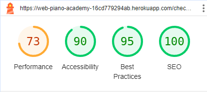

# Testing

Return back to the [README.md](README.md) file.

## Code Validation

### HTML

I have used the recommended [HTML W3C Validator](https://validator.w3.org) to validate all of my HTML files.

| Page | W3C URL | Screenshot | Notes |
| --- | --- | --- | --- |
| 400 | [W3C - Validated By Input](https://validator.w3.org/#validate_by_input) |  | Pass: No Errors |
| 403 | [W3C - Validated By Input](https://validator.w3.org/#validate_by_input) |  | Pass: No Errors |
| 404 | [W3C - Validated By Input](https://validator.w3.org/#validate_by_input) |  | Pass: No Errors |
| 500 | [W3C - Validated By Input](https://validator.w3.org/#validate_by_input) |  | Pass: No Errors |
| about | [W3C](https://validator.w3.org/nu/?doc=https%3A%2F%2Fweb-piano-academy-16cd779294ab.herokuapp.com%2Fabout%2F) |  | Pass: No Errors |
| add-product | [W3C - Validated By Input](https://validator.w3.org/#validate_by_input) |  | Pass: No Errors |
| basket | [W3C](https://validator.w3.org/nu/?doc=https%3A%2F%2Fweb-piano-academy-16cd779294ab.herokuapp.com%2Fbasket%2F) |  | Pass: No Errors |
| checkout | [W3C](https://validator.w3.org/nu/?doc=https%3A%2F%2Fweb-piano-academy-16cd779294ab.herokuapp.com%2Fcheckout%2F) |  | Pass: No Errors |
| checkout-success | [W3C - Validated By Input](https://validator.w3.org/#validate_by_input) |  | Pass: No Errors |
| contact | [W3C](https://validator.w3.org/nu/?doc=https%3A%2F%2Fweb-piano-academy-16cd779294ab.herokuapp.com%2Fcontact%2F) |  | Pass: No Errors |
| contact-confirm-delete | [W3C - Validated By Input](https://validator.w3.org/#validate_by_input) |  | Pass: No Errors |
| contact-list | [W3C - Validated By Input](https://validator.w3.org/#validate_by_input) |  | Pass: No Errors |
| contact-success | [W3C](https://validator.w3.org/nu/?doc=https%3A%2F%2Fweb-piano-academy-16cd779294ab.herokuapp.com%2Fcontact%2Fsuccess%2F) |  | Pass: No Errors |
| contact-update-form | [W3C - Validated By Input](https://validator.w3.org/#validate_by_input) |  | Pass: No Errors |
| courses | [W3C](https://validator.w3.org/nu/?doc=https%3A%2F%2Fweb-piano-academy-16cd779294ab.herokuapp.com%2Fproducts%2Fcourses%2F) |  | Pass: No Errors |
| edit-product | [W3C - Validated By Input](https://validator.w3.org/#validate_by_input) |  | Pass: No Errors |
| email-form | [W3C](https://validator.w3.org/nu/?doc=https%3A%2F%2Fweb-piano-academy-16cd779294ab.herokuapp.com%2Fnewsletter%2F) |  | Pass: No Errors |
| faq | [W3C](https://validator.w3.org/nu/?doc=https%3A%2F%2Fweb-piano-academy-16cd779294ab.herokuapp.com%2Ffaq%2F) |  | Pass: No Errors |
| home | [W3C](https://validator.w3.org/nu/?doc=https%3A%2F%2Fweb-piano-academy-16cd779294ab.herokuapp.com%2F) |  | Pass: No Errors |
| login | [W3C](https://validator.w3.org/nu/?doc=https%3A%2F%2Fweb-piano-academy-16cd779294ab.herokuapp.com%2Faccounts%2Flogin%2F) |  | Pass: No Errors |
| product-detail | [W3C](https://validator.w3.org/nu/?doc=https%3A%2F%2Fweb-piano-academy-16cd779294ab.herokuapp.com%2Fproducts%2Fcourses%2F12%2F) |  | Pass: No Errors |
| profile | [W3C - Validated By Input](https://validator.w3.org/#validate_by_input) |  | Pass: No Errors |
| register | [W3C](https://validator.w3.org/nu/?doc=https%3A%2F%2Fweb-piano-academy-16cd779294ab.herokuapp.com%2Faccounts%2Fsignup%2F) |  | Pass: No Errors |
| unsubscribe | [W3C - Validated By Input](https://validator.w3.org/#validate_by_input) |  | Pass: No Errors |

### CSS

I have used the recommended [CSS Jigsaw Validator](https://jigsaw.w3.org/css-validator) to validate all of my CSS files.

| File | Jigsaw URL | Screenshot | Notes |
| --- | --- | --- | --- |
| style.css | [Jigsaw](https://jigsaw.w3.org/css-validator/validator?uri=https%3A%2F%2Fweb-piano-academy-16cd779294ab.herokuapp.com%2F&profile=css3svg&usermedium=all&warning=1&vextwarning=&lang=en) |  | Pass: No Errors |
| checkout.css | n/a |  | Pass: No Errors |
| profile.css | n/a |  | Pass: No Errors |

### JavaScript

I have used the recommended [JShint Validator](https://jshint.com) to validate all of my JS files.

| File | Screenshot | Notes |
| --- | --- | --- |
| stripe_elements.js |  | Undefined Stripe variable |
| tooltips.js |  | Pass: No Errors |
| navbar.js |  | Pass: No Errors |
| countryfield.js |  | Pass: No Errors |

### Python

I have used the recommended [PEP8 CI Python Linter](https://pep8ci.herokuapp.com) to validate all of my Python files.

### Basket App
| File | CI URL | Screenshot | Notes |
| --- | --- | --- | --- |
| apps.py | [PEP8 CI](https://pep8ci.herokuapp.com/https://raw.githubusercontent.com/LewisMDillon/web-piano-academy/main/apps.py) |  | Pass: No Errors |
| contexts.py | [PEP8 CI](https://pep8ci.herokuapp.com/https://raw.githubusercontent.com/LewisMDillon/web-piano-academy/main/contexts.py) |  | Pass: No Errors |
| tests.py | [PEP8 CI](https://pep8ci.herokuapp.com/https://raw.githubusercontent.com/LewisMDillon/web-piano-academy/main/tests.py) |  | Pass: No Errors |
| urls.py | [PEP8 CI](https://pep8ci.herokuapp.com/https://raw.githubusercontent.com/LewisMDillon/web-piano-academy/main/urls.py) |  | Pass: No Errors |
| views.py | [PEP8 CI](https://pep8ci.herokuapp.com/https://raw.githubusercontent.com/LewisMDillon/web-piano-academy/main/views.py) |  | Pass: No Errors |

### Checkout App
| File | CI URL | Screenshot | Notes |
| --- | --- | --- | --- |
| admin.py | [PEP8 CI](https://pep8ci.herokuapp.com/https://raw.githubusercontent.com/LewisMDillon/web-piano-academy/main/admin.py) |  | Pass: No Errors |
| apps.py | [PEP8 CI](https://pep8ci.herokuapp.com/https://raw.githubusercontent.com/LewisMDillon/web-piano-academy/main/apps.py) |  | Pass: No Errors |
| forms.py | [PEP8 CI](https://pep8ci.herokuapp.com/https://raw.githubusercontent.com/LewisMDillon/web-piano-academy/main/forms.py) |  | Pass: No Errors |
| init.py | [PEP8 CI](https://pep8ci.herokuapp.com/https://raw.githubusercontent.com/LewisMDillon/web-piano-academy/main/__init__.py) |  | Pass: No Errors |
| models.py | [PEP8 CI](https://pep8ci.herokuapp.com/https://raw.githubusercontent.com/LewisMDillon/web-piano-academy/main/models.py) |  | Pass: No Errors |
| signals.py | [PEP8 CI](https://pep8ci.herokuapp.com/https://raw.githubusercontent.com/LewisMDillon/web-piano-academy/main/signals.py) |  | Pass: No Errors |
| tests.py | [PEP8 CI](https://pep8ci.herokuapp.com/https://raw.githubusercontent.com/LewisMDillon/web-piano-academy/main/tests.py) |  | Pass: No Errors |
| urls.py | [PEP8 CI](https://pep8ci.herokuapp.com/https://raw.githubusercontent.com/LewisMDillon/web-piano-academy/main/urls.py) |  | Pass: No Errors |
| views.py | [PEP8 CI](https://pep8ci.herokuapp.com/https://raw.githubusercontent.com/LewisMDillon/web-piano-academy/main/views.py) |  | Pass: No Errors |
| webhook_handler.py | [PEP8 CI](https://pep8ci.herokuapp.com/https://raw.githubusercontent.com/LewisMDillon/web-piano-academy/main/webhook_handler.py) |  | Pass: No Errors |
| webhooks.py | [PEP8 CI](https://pep8ci.herokuapp.com/https://raw.githubusercontent.com/LewisMDillon/web-piano-academy/main/webhooks.py) |  | Pass: No Errors |

### Config App
| File | CI URL | Screenshot | Notes |
| --- | --- | --- | --- |
| asgi.py | [PEP8 CI](https://pep8ci.herokuapp.com/https://raw.githubusercontent.com/LewisMDillon/web-piano-academy/main/asgi.py) |  | Pass: No Errors |
| settings.py | [PEP8 CI](https://pep8ci.herokuapp.com/https://raw.githubusercontent.com/LewisMDillon/web-piano-academy/main/settings.py) |  | Pass: No Errors |
| urls.py | [PEP8 CI](https://pep8ci.herokuapp.com/https://raw.githubusercontent.com/LewisMDillon/web-piano-academy/main/urls.py) |  | Pass: No Errors |
| views.py | [PEP8 CI](https://pep8ci.herokuapp.com/https://raw.githubusercontent.com/LewisMDillon/web-piano-academy/main/views.py) |  | Pass: No Errors |
| wsgi.py | [PEP8 CI](https://pep8ci.herokuapp.com/https://raw.githubusercontent.com/LewisMDillon/web-piano-academy/main/wsgi.py) |  | Pass: No Errors |

### Contact App
| File | CI URL | Screenshot | Notes |
| --- | --- | --- | --- |
| admin.py | [PEP8 CI](https://pep8ci.herokuapp.com/https://raw.githubusercontent.com/LewisMDillon/web-piano-academy/main/admin.py) |  | Pass: No Errors |
| apps.py | [PEP8 CI](https://pep8ci.herokuapp.com/https://raw.githubusercontent.com/LewisMDillon/web-piano-academy/main/apps.py) |  | Pass: No Errors |
| models.py | [PEP8 CI](https://pep8ci.herokuapp.com/https://raw.githubusercontent.com/LewisMDillon/web-piano-academy/main/models.py) |  | Pass: No Errors |
| tests.py | [PEP8 CI](https://pep8ci.herokuapp.com/https://raw.githubusercontent.com/LewisMDillon/web-piano-academy/main/tests.py) |  | Pass: No Errors |
| urls.py | [PEP8 CI](https://pep8ci.herokuapp.com/https://raw.githubusercontent.com/LewisMDillon/web-piano-academy/main/urls.py) |  | Pass: No Errors |
| views.py | [PEP8 CI](https://pep8ci.herokuapp.com/https://raw.githubusercontent.com/LewisMDillon/web-piano-academy/main/views.py) |  | Pass: No Errors |

### Faq App
| File | CI URL | Screenshot | Notes |
| --- | --- | --- | --- |
| admin.py | [PEP8 CI](https://pep8ci.herokuapp.com/https://raw.githubusercontent.com/LewisMDillon/web-piano-academy/main/admin.py) |  | Pass: No Errors |
| apps.py | [PEP8 CI](https://pep8ci.herokuapp.com/https://raw.githubusercontent.com/LewisMDillon/web-piano-academy/main/apps.py) |  | Pass: No Errors |
| models.py | [PEP8 CI](https://pep8ci.herokuapp.com/https://raw.githubusercontent.com/LewisMDillon/web-piano-academy/main/models.py) |  | Pass: No Errors |
| tests.py | [PEP8 CI](https://pep8ci.herokuapp.com/https://raw.githubusercontent.com/LewisMDillon/web-piano-academy/main/tests.py) |  | Pass: No Errors |
| urls.py | [PEP8 CI](https://pep8ci.herokuapp.com/https://raw.githubusercontent.com/LewisMDillon/web-piano-academy/main/urls.py) |  | Pass: No Errors |
| views.py | [PEP8 CI](https://pep8ci.herokuapp.com/https://raw.githubusercontent.com/LewisMDillon/web-piano-academy/main/views.py) |  | Pass: No Errors |

### Home App
| File | CI URL | Screenshot | Notes |
| --- | --- | --- | --- |
| apps.py | [PEP8 CI](https://pep8ci.herokuapp.com/https://raw.githubusercontent.com/LewisMDillon/web-piano-academy/main/apps.py) |  | Pass: No Errors |
| tests.py | [PEP8 CI](https://pep8ci.herokuapp.com/https://raw.githubusercontent.com/LewisMDillon/web-piano-academy/main/tests.py) |  | Pass: No Errors |
| urls.py | [PEP8 CI](https://pep8ci.herokuapp.com/https://raw.githubusercontent.com/LewisMDillon/web-piano-academy/main/urls.py) |  | Pass: No Errors |
| views.py | [PEP8 CI](https://pep8ci.herokuapp.com/https://raw.githubusercontent.com/LewisMDillon/web-piano-academy/main/views.py) |  | Pass: No Errors |

### Newsletter App
| File | CI URL | Screenshot | Notes |
| --- | --- | --- | --- |
| admin.py | [PEP8 CI](https://pep8ci.herokuapp.com/https://raw.githubusercontent.com/LewisMDillon/web-piano-academy/main/admin.py) |  | Pass: No Errors |
| apps.py | [PEP8 CI](https://pep8ci.herokuapp.com/https://raw.githubusercontent.com/LewisMDillon/web-piano-academy/main/apps.py) |  | Pass: No Errors |
| models.py | [PEP8 CI](https://pep8ci.herokuapp.com/https://raw.githubusercontent.com/LewisMDillon/web-piano-academy/main/models.py) |  | Pass: No Errors |
| tests.py | [PEP8 CI](https://pep8ci.herokuapp.com/https://raw.githubusercontent.com/LewisMDillon/web-piano-academy/main/tests.py) |  | Pass: No Errors |
| urls.py | [PEP8 CI](https://pep8ci.herokuapp.com/https://raw.githubusercontent.com/LewisMDillon/web-piano-academy/main/urls.py) |  | Pass: No Errors |
| views.py | [PEP8 CI](https://pep8ci.herokuapp.com/https://raw.githubusercontent.com/LewisMDillon/web-piano-academy/main/views.py) |  | Pass: No Errors |

### Products App
| File | CI URL | Screenshot | Notes |
| --- | --- | --- | --- |
| admin.py | [PEP8 CI](https://pep8ci.herokuapp.com/https://raw.githubusercontent.com/LewisMDillon/web-piano-academy/main/admin.py) |  | Pass: No Errors |
| apps.py | [PEP8 CI](https://pep8ci.herokuapp.com/https://raw.githubusercontent.com/LewisMDillon/web-piano-academy/main/apps.py) |  | Pass: No Errors |
| forms.py | [PEP8 CI](https://pep8ci.herokuapp.com/https://raw.githubusercontent.com/LewisMDillon/web-piano-academy/main/forms.py) |  | Pass: No Errors |
| models.py | [PEP8 CI](https://pep8ci.herokuapp.com/https://raw.githubusercontent.com/LewisMDillon/web-piano-academy/main/models.py) |  | Pass: No Errors |
| tests.py | [PEP8 CI](https://pep8ci.herokuapp.com/https://raw.githubusercontent.com/LewisMDillon/web-piano-academy/main/tests.py) |  | Pass: No Errors |
| urls.py | [PEP8 CI](https://pep8ci.herokuapp.com/https://raw.githubusercontent.com/LewisMDillon/web-piano-academy/main/urls.py) |  | Pass: No Errors |
| views.py | [PEP8 CI](https://pep8ci.herokuapp.com/https://raw.githubusercontent.com/LewisMDillon/web-piano-academy/main/views.py) |  | Pass: No Errors |

### Profiles App
| File | CI URL | Screenshot | Notes |
| --- | --- | --- | --- |
| admin.py | [PEP8 CI](https://pep8ci.herokuapp.com/https://raw.githubusercontent.com/LewisMDillon/web-piano-academy/main/admin.py) |  | Pass: No Errors |
| apps.py | [PEP8 CI](https://pep8ci.herokuapp.com/https://raw.githubusercontent.com/LewisMDillon/web-piano-academy/main/apps.py) |  | Pass: No Errors |
| forms.py | [PEP8 CI](https://pep8ci.herokuapp.com/https://raw.githubusercontent.com/LewisMDillon/web-piano-academy/main/forms.py) |  | Pass: No Errors |
| models.py | [PEP8 CI](https://pep8ci.herokuapp.com/https://raw.githubusercontent.com/LewisMDillon/web-piano-academy/main/models.py) |  | Pass: No Errors |
| tests.py | [PEP8 CI](https://pep8ci.herokuapp.com/https://raw.githubusercontent.com/LewisMDillon/web-piano-academy/main/tests.py) |  | Pass: No Errors |
| urls.py | [PEP8 CI](https://pep8ci.herokuapp.com/https://raw.githubusercontent.com/LewisMDillon/web-piano-academy/main/urls.py) |  | Pass: No Errors |
| views.py | [PEP8 CI](https://pep8ci.herokuapp.com/https://raw.githubusercontent.com/LewisMDillon/web-piano-academy/main/views.py) |  | Pass: No Errors |

### Root Level Files
| File | CI URL | Screenshot | Notes |
| --- | --- | --- | --- |
| custom_storages.py | [PEP8 CI](https://pep8ci.herokuapp.com/https://raw.githubusercontent.com/LewisMDillon/web-piano-academy/main/custom_storages.py) |  | Pass: No Errors |
| manage.py | [PEP8 CI](https://pep8ci.herokuapp.com/https://raw.githubusercontent.com/LewisMDillon/web-piano-academy/main/manage.py) |  | Pass: No Errors |

## Browser Compatibility

I've tested my deployed project on multiple browsers to check for compatibility issues.

| Browser | Screenshot | Notes |
| --- | --- | --- |
| Brave |  | Works as expected |
| Chrome |  | Works as expected |
| Edge |  | Works as expected |
| Firefox |  | Works as expected |
| Internet Explorer |  | Multiple Broken Elements  |
| Opera |  | Works as expected |
| Safari |  | Works as expected |

## Responsiveness

I've tested my deployed project on multiple devices to check for responsiveness issues.

| Device | Screenhot | Notes |
| --- | --- | --- |
| Mobile (DevTools) |  | Works as expected |
| Tablet (DevTools) |  | Works as expected |
| Desktop |  | Works as expected |
| XL Monitor |  | Scaling starts to have minor issues |
| 4k Monitor |  | Noticeable scaling issues |
| Oneplus Nord |  | Works as expected |
| iPhone15 |  | Works as expected |

## Lighthouse Audit

I've tested my deployed project using the Lighthouse Audit tool to check for any major issues.

On all pages, Lighthouse is flagging a warning 'Issues were logged in the Issues panel in Chrome Devtools'. This is caused by the built-in Stripe element used by the site.

| Page | Mobile | Desktop | Notes |
| --- | --- | --- | --- |
| 400 |  |  | Some Minor Warnings |
| 403 |  |  | Some Minor Warnings |
| 404 |  |  | Some Minor Warnings |
| 500 |  |  | Some Minor Warnings |
| about |  |  | Some Minor Warnings |
| add-product |  |  | Some Minor Warnings |
| basket |  |  | Some Minor Warnings |
| checkout |  |  | Warning about country input element with no label - this element is dynamically labelled by javascript |
| checkout-success |  |  | Some Minor Warnings |
| contact |  |  | Some Minor Warnings |
| contact-confirm-delete |  |  | Some Minor Warnings |
| contact-list |  |  | Some Minor Warnings |
| contact-success |  |  | Some Minor Warnings |
| contact-update-form |  |  | Some Minor Warnings |
| courses |  |  | Some Minor Warnings |
| edit-product |  |  | Some Minor Warnings |
| email-form |  |  | Some Minor Warnings |
| faq |  |  | Some Minor Warnings |
| home |  |  | Some Minor Warnings |
| login |  |  | Some Minor Warnings |
| product-detail |  |  | Some Minor Warnings |
| profile |  |  | Warning about country input element with no label - this element is dynamically labelled by javascript |
| register |  |  | Some Minor Warnings |
| unsubscribe |  |  | Some Minor Warnings |

## Defensive Programming

Defensive programming was manually tested with the below user acceptance testing:

| Page | User Action | Expected Result | Pass/Fail | Comments |
| --- | --- | --- | --- | --- |
| Nav links | | | | |
| | Click on Logo | Redirection to Home page | Pass | |
| | Click on site name in navbar | Redirection to Home page | Pass | |
| | Click on About Us link in navbar | Redirection to About page | Pass | |
| | Click on Courses - All Courses link in navbar | Redirection to Courses page | Pass | |
| | Click on Courses - Classical link in navbar | Redirection to Courses page - Display only 'Classical' category courses | Pass | |
| | Click on Courses - Jazz link in navbar | Redirection to Courses page - Display only 'Jazz' category courses | Pass | |
| | Click on Courses - Pop link in navbar | Redirection to Courses page - Display only 'Pop' category courses | Pass | |
| | Click on Courses - Music Theory link in navbar | Redirection to Courses page - Display only 'Music Theory' category courses | Pass | |
| | Click on Faq link in navbar | Redirection to Faq page | Pass | |
| | Click on Contact link in navbar | Redirection to Contact page | Pass | |
| | Click on Search link in navbar | Search box dropdown, with input to search on courses page | Pass | |
| | Click on Register link in navbar | Redirection to Register page | Pass | |
| | Click on Login link in navbar | Redirection to Login page | Pass | |
| | Click on Basket link in navbar | Redirection to Basket page | Pass | |
| | Click on My Account - My Profile link in navbar | Redirection to User Profile page | Pass | |
| | Click on My Account - Logout link in navbar | Redirection to Logout page | Pass | |
| | Click on Add New Product link in navbar | Redirection to Add Product page | Pass | |
| | Click on Edit A Product link in navbar | Redirection to Courses page | Pass | |
| | Click on Delete A Product link in navbar | Redirection to Courses page | Pass | |
| | Click on Contact Requests link in navbar | Redirection to Contact Requests page | Pass | |
| Footer | | | | |
| | Click on Home link | Redirection to Home page | Pass | |
| | Click on Our Courses | Redirection to Courses page | Pass | |
| | Click on About Us link in footer | Redirection to About page | Pass | |
| | Click on Faqs link in footer | Redirection to Faq page | Pass | |
| | Click on Contact link in footer | Redirection to Contact page | Pass | |
| | Click on Register link in footer | Redirection to Register page | Pass | |
| | Click on Login link in footer | Redirection to Login page | Pass | |
| | Click on My Profile link in footer | Redirection to User Profile page | Pass | |
| | Click on Logout link in footer | Redirection to Logout page | Pass | |
| | Click on 'Subcribe to our mailing list' button in footer | Redirection to Newsletter Subscription page | Pass | |
| Register | | | | |
| | Enter valid email address (twice) | Field will only accept email address format | Pass | |
| | Enter valid password (twice) | Field will only accept password format | Pass | |
| | Click on Sign Up button | Redirects user to blank Login page | Pass |
| | Click on Back To Login button | Redirects user to Login page | Pass |
| Log In | | | | |
| | Enter valid username/email | Field will accept username or email format | Pass | |
| | Enter valid password | Field will only accept password format | Pass | |
| | Click Login button | Log user in, Redirects to home page | Pass | |
| Log Out | | | | |
| | Click Logout button | Logs out user, Redirects user to home page | Pass |
| Profile | | | | |
| | Click on the Update Information button | Inputted information is saved | Pass | |
| | Click on Order History links | Redirects to user order confirmation | Pass | |
| Site Navigations - Logged Out User | | | | |
| | Navigate to any login required URL | Redirect to login page, redirect back after login | Pass | |
| Courses | | | | |
| | Click on course image | Redirect to clicked course details page | Pass | |
| | Click on course title | Redirect to clicked course details page | Pass | |
| | Click on sorting dropdown options | Sort courses by selected criteria | Pass | |
| Courses - Admin Only| | | | |
| | Click on an edit button | Redirect to edit product page for that course | Pass | |
| | Click on a delete button | Trigger delete confirmation modal | Pass | |
| | Delete confirmation modal - 'yes, delete' button | Delete the course | Pass | |
| | Delete confirmation modal - 'no, go back' button | Close the modal | Pass | |
| Product Details | | | | |
| | Click on course image | Load full image | Pass | |
| | Click on 'Back To Our Courses' button | Redirect to courses page | Pass | |
| | Click on 'Add To Basket' button | Adds product to basket, basket message displayed | Pass | |
| Product Details - Admin Only | | | | |
| | Click on Edit button | Redirect to edit product page for that course | Pass | |
| | Click on Delete button | Trigger delete confirmation modal | Pass | |
| | Delete confirmation modal - 'yes, delete' button | Delete the course | Pass | |
| | Delete confirmation modal - 'no, go back' button | Close the modal | Pass | |
| FAQ | | | | |
| | Click on question | Dropdown with answer appears | Pass | |
| | Click on open question | Dropdown with answer disappears | Pass | |
| Contact | | | | |
| | Email input | Auto-fills if user is logged in | Pass | |
| | Email input | Required, accepts only email format | Pass | |
| | Name input | Required | Pass | |
| | Subject input | Required, user given a list of options | Pass | |
| | Message input | Required, Max characters = 1024 | Pass | |
| | Click on 'Send' button | Posts form if valid, redirects to contact success page | Pass | |
| Contact Requests - Admin Only | | | | |
| | Click on a 'View Details' link | Redirect to clicked message details page | Pass | |
| Message Details - Admin Only | | | | |
| | Click on 'Back To Contact List' link | Redirect to contact list page | Pass | |
| | Click on 'Respond To Message' button | Email dropdown appears | Pass | |
| | Click on 'Respond To Message' button while open | Email dropdown disappears | Pass | |
| | Click on a 'Send Email' button | Email is sent to displayed address, success message displayed, Respond button disappears | Pass | |
| | Click on 'Delete Message' button | Redirect to message delete confirmation page | Pass | |
| Message Delete - Admin Only | | | | |
| | Click on 'Yes, Delete It' button | Message is deleted, success message displayed, redirect to contact list page | Pass | |
| | Click on 'No, Go Back' button | Redirect to message details page | Pass | |
| Add New Product - Admin Only | | | | |
| | Category Input | Not required, select from options | Pass | |
| | Level Input | Not required, select from options | Pass | |
| | Level Display Name Input | Not required | Pass | |
| | Name Input | Required | Pass | |
| | Subtitle Input | Not required | Pass | |
| | Description Input | Required | Pass | |
| | Price Input | Required, Numbers only | Pass | |
| | Course URL | Not required | Pass | |
| | Image URL | Not required | Pass | |
| | Image | Not required | Pass | |
| Edit Product - Admin Only | | | | |
| | Click on 'Cancel' button | Redirect to Courses page | Pass | |
| | Click on 'Update Product' button | Save changes, redirect to course details page | Pass | |
| Delete Product - Admin Only | | | | |
| | Click on Delete button | Trigger delete confirmation modal | Pass | |
| | Delete confirmation modal - 'yes, delete' button | Delete the course | Pass | |
| | Delete confirmation modal - 'no, go back' button | Close the modal | Pass | |
| Basket | | | | |
| | Click on 'Remove This Item' link | Remove item from basket | Pass | |
| | Click on 'Back To Courses' button | Redirect to Courses page | Pass | |
| | Click on 'Secure Checkout' button | Redirect to Checkout page | Pass | |
| Checkout | | | | |
| | Full Name Input | Required | Pass | |
| | Email Input | Required, autofill if saved | Pass | |
| | Phone Number Input | Required, autofill if saved | Pass | |
| | Street Address 1 Input | Required, autofill if saved | Pass | |
| | Street Address 2 Input | Not required, autofill if saved | Pass | |
| | Town Or City Input | Required, autofill if saved | Pass | |
| | County Input | Not required, autofill if saved | Pass | |
| | Postal Code Input | Not required, autofill if saved | Pass | |
| | Country Input | Required, autofill if saved, select from options | Pass | |
| | Stripe Card Details | Required, validates on input | Pass | |
| | Hover over Address Details tooltip icon | Displays tooltip | Pass | |
| | Check 'save delivery info.' box | Saves information to user profile | Pass | |
| | Click course image in order summary | Redirect to the course details page | Pass | |
| | Click on 'Adjust Basket' button | Redirect to Basket page | Pass | |
| | Click on 'Complete Order' button | Complete Checkout with given information, redirect to order confirmation page if valid | Pass | |
| Newsletter - Subscribe | | | | |
| | Email Input | Required, autofills if user is logged in, accepts only email format | Pass | |
| | Click on 'Subscribe' button | Subscribes user, redirects to homepage, displays success message | Pass | |
| Newsletter - Unsubscribe | | | | |
| | Click on 'Unsubscribe' button | Unsubscribes user, redirects to homepage, displays success message | Pass | |

